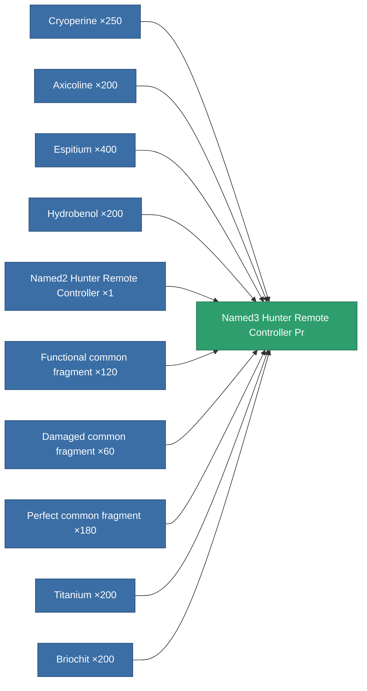

<!-- Generated by tools/generate from the live database (source: entitydefaults definition 8997, aggregatevalues via aggregatefields).
     Do not edit by hand; regenerate instead. -->

# Named3 Hunter Remote Controller Pr

|  |  |
|---|---|
| Definition | `def_named3_hunter_remote_controller_pr` |
| Tier | T4 (prototype) |
| Health | 100 |
| Volume | 100 |
| Mass | 400 |
| Category | Modules / Remote control |
| Tier line | [Standard Hunter Remote Controller](/content/items/standard-hunter-remote-controller/) (T1) → [Named1 Hunter Remote Controller](/content/items/named1-hunter-remote-controller/) (T2) → [Named2 Hunter Remote Controller](/content/items/named2-hunter-remote-controller/) (T3) → [Named3 Hunter Remote Controller](/content/items/named3-hunter-remote-controller/) (T4) → **Named3 Hunter Remote Controller Pr** (T4) |
| Note | Deploys an autonomous hunter drone -- PvE ammo hunts Niani NPCs, PvP ammo hunts hostile-standing players. |

## Stats

| Field | Value |
|---|---|
| core_usage | 165 |
| cpu_usage | 275 |
| cycle_time | 3.5k |
| detection_range | 130 |
| powergrid_usage | 70 |
| remote_control_bandwidth_max | 1 |
| remote_control_lifetime | 2.52M |
| remote_control_operational_range | 210 |

<!-- production:generated -->
## Production

**Produced from 10 components, research level 8** — assemble the components to build it (see [Recipes](/content/recipes/) for the full list):

[All items](/content/items/)
