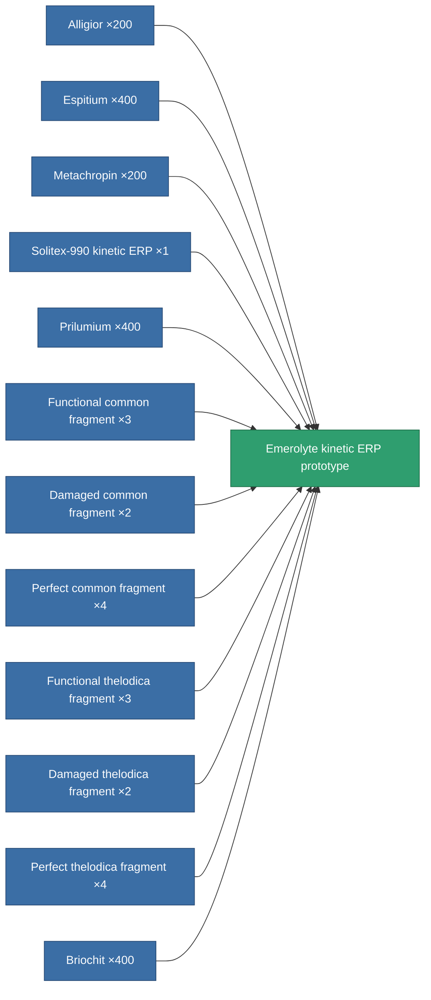

<!-- Generated by tools/generate from the live database (source: entitydefaults definition 3357, aggregatevalues via aggregatefields).
     Do not edit by hand; regenerate instead. -->

# Emerolyte kinetic ERP prototype

|  |  |
|---|---|
| Definition | `def_named3_kinetic_kers_pr` |
| Tier | T4 (prototype) |
| Health | 100 |
| Volume | 1 |
| Mass | 393.75 |
| Category | Modules / Enhancements |
| Tier line | [Standard kinetic ERP](/content/items/standard-kinetic-kers/) (T1) → [Hegatex-1000 kinetic ERP](/content/items/named1-kinetic-kers/) (T2) → [Solitex-990 kinetic ERP](/content/items/named2-kinetic-kers/) (T3) → [Emerolyte kinetic ERP](/content/items/named3-kinetic-kers/) (T4) → **Emerolyte kinetic ERP prototype** (T4) |

## Stats

| Field | Value |
|---|---|
| chemical_damage_to_core_modifier | 0.3 |
| cpu_usage | 54 |
| explosive_damage_to_core_modifier | 0.15 |
| kinetic_damage_to_core_modifier | 0.7 |
| powergrid_usage | 19 |
| thermal_damage_to_core_modifier | 0.15 |

<!-- production:generated -->
## Production

**Produced from 12 components, research level 9** — assemble the components to build it (see [Recipes](/content/recipes/) for the full list):

[All items](/content/items/)
