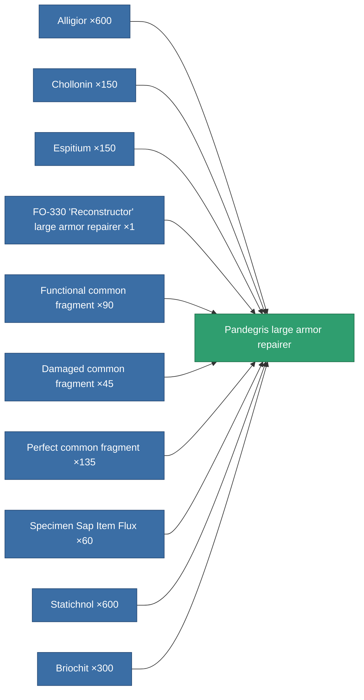

<!-- Generated by tools/generate from the live database (source: entitydefaults definition 701, aggregatevalues via aggregatefields).
     Do not edit by hand; regenerate instead. -->

# Pandegris large armor repairer

|  |  |
|---|---|
| Definition | `def_named3_large_armor_repairer` |
| Tier | T4 |
| Health | 100 |
| Volume | 3 |
| Mass | 1600 |
| Category | Modules / Repair |
| Tier line | [Standard large armor repairer](/content/items/standard-large-armor-repairer/) (T1) → [Stesodenn large armor repairer](/content/items/named1-large-armor-repairer/) (T2) → [FO-330 'Reconstructor' large armor repairer](/content/items/named2-large-armor-repairer/) (T3) → **Pandegris large armor repairer** (T4) |

## Stats

| Field | Value |
|---|---|
| armor_repair_amount | 460 |
| core_usage | 495 |
| cpu_usage | 440 |
| cycle_time | 12k |
| powergrid_usage | 1.1k |

<!-- production:generated -->
## Production

**Produced from 10 components** — assemble the components to build it (see [Recipes](/content/recipes/) for the full list):

[All items](/content/items/)
