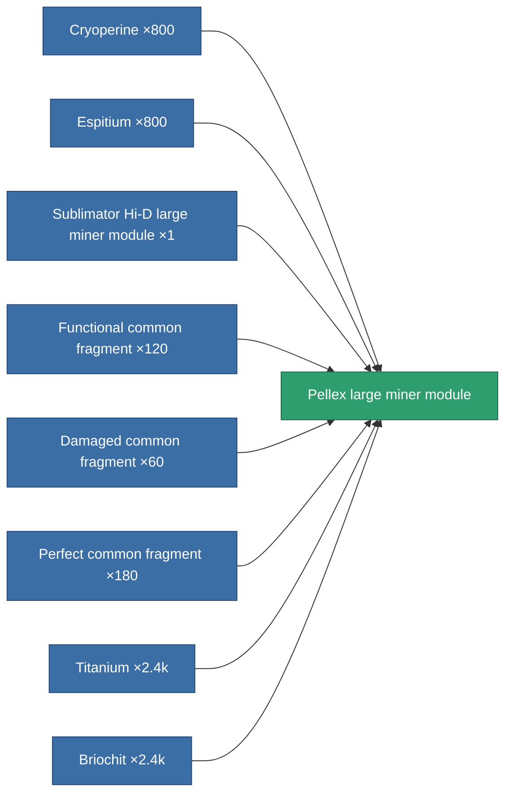

<!-- Generated by tools/generate from the live database (source: entitydefaults definition 8686, aggregatevalues via aggregatefields).
     Do not edit by hand; regenerate instead. -->

# Pellex large miner module

|  |  |
|---|---|
| Definition | `def_named3_large_driller` |
| Tier | T4 |
| Health | 100 |
| Volume | 2.5 |
| Mass | 1500 |
| Category | Modules / Enhancements |
| Tier line | [Standard large miner module](/content/items/standard-large-driller/) (T1) → [MMA v19-'Widge' large miner module](/content/items/named1-large-driller/) (T2) → [Sublimator Hi-D large miner module](/content/items/named2-large-driller/) (T3) → **Pellex large miner module** (T4) |

## Stats

| Field | Value |
|---|---|
| core_usage | 195 |
| cpu_usage | 495 |
| cycle_time | 10k |
| powergrid_usage | 1.458k |

<!-- production:generated -->
## Production

**Produced from 8 components** — assemble the components to build it (see [Recipes](/content/recipes/) for the full list):

[All items](/content/items/)
