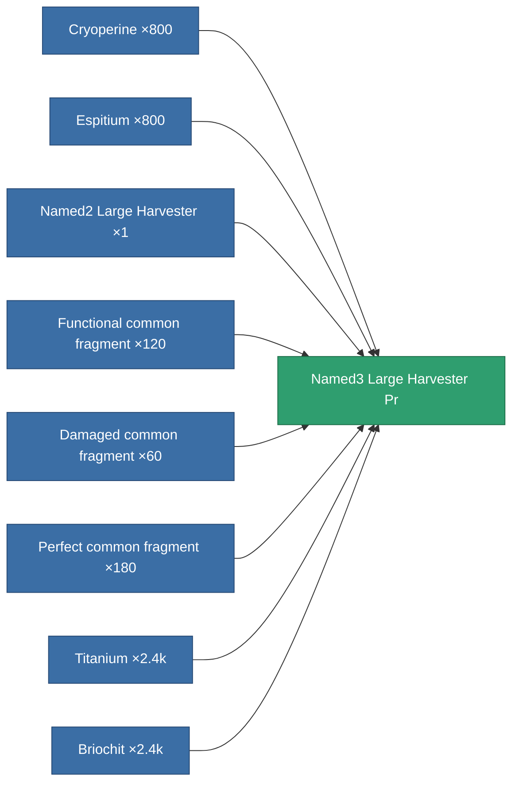

<!-- Generated by tools/generate from the live database (source: entitydefaults definition 8870, aggregatevalues via aggregatefields).
     Do not edit by hand; regenerate instead. -->

# Named3 Large Harvester Pr

|  |  |
|---|---|
| Definition | `def_named3_large_harvester_pr` |
| Tier | 4 |
| Health | 100 |
| Volume | 2.5 |
| Mass | 1250 |
| Category | Modules / Harvesting |

## Stats

| Field | Value |
|---|---|
| core_usage | 252 |
| cpu_usage | 468 |
| cycle_time | 10k |
| powergrid_usage | 1.458k |

<!-- production:generated -->
## Production

**Produced from 8 components, research level 8** — assemble the components to build it (see [Recipes](/content/recipes/) for the full list):

[All items](/content/items/)
