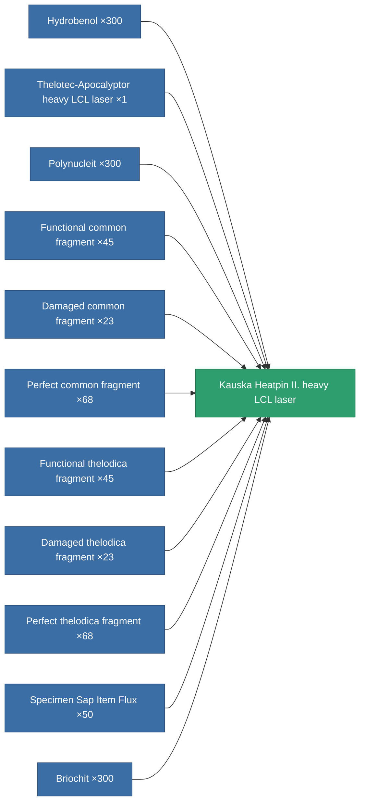

<!-- Generated by tools/generate from the live database (source: entitydefaults definition 839, aggregatevalues via aggregatefields).
     Do not edit by hand; regenerate instead. -->

# Kauska Heatpin II. heavy LCL laser

|  |  |
|---|---|
| Definition | `def_named3_large_laser` |
| Tier | T4 |
| Health | 100 |
| Volume | 1.5 |
| Mass | 1100 |
| Category | Modules / Weapons |
| Tier line | [Standard heavy LCL laser](/content/items/standard-large-laser/) (T1) → [Thelotec-Etequitor heavy LCL laser](/content/items/named1-large-laser/) (T2) → [Thelotec-Apocalyptor heavy LCL laser](/content/items/named2-large-laser/) (T3) → **Kauska Heatpin II. heavy LCL laser** (T4) |

## Stats

| Field | Value |
|---|---|
| accuracy | 34.5 |
| core_usage | 13.44 |
| cpu_usage | 75 |
| cycle_time | 5k |
| damage_modifier | 2.4 |
| falloff | 10 |
| optimal_range | 24 |
| powergrid_usage | 437.5 |

<!-- production:generated -->
## Production

**Produced from 11 components** — assemble the components to build it (see [Recipes](/content/recipes/) for the full list):

[All items](/content/items/)
