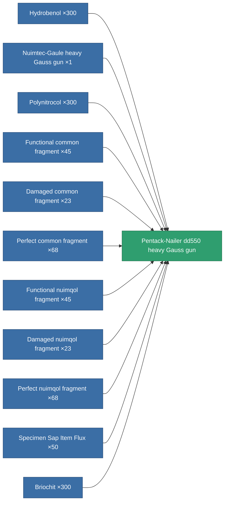

<!-- Generated by tools/generate from the live database (source: entitydefaults definition 866, aggregatevalues via aggregatefields).
     Do not edit by hand; regenerate instead. -->

# Pentack-Nailer dd550 heavy Gauss gun

|  |  |
|---|---|
| Definition | `def_named3_large_railgun` |
| Tier | 4 |
| Health | 100 |
| Volume | 1.5 |
| Mass | 1100 |
| Category | Modules / Weapons |

## Stats

| Field | Value |
|---|---|
| accuracy | 40.5 |
| core_usage | 14 |
| cpu_usage | 95 |
| cycle_time | 8k |
| damage_modifier | 4.5 |
| falloff | 6 |
| optimal_range | 22.5 |
| powergrid_usage | 270 |

<!-- production:generated -->
## Production

**Produced from 11 components** — assemble the components to build it (see [Recipes](/content/recipes/) for the full list):

[All items](/content/items/)
