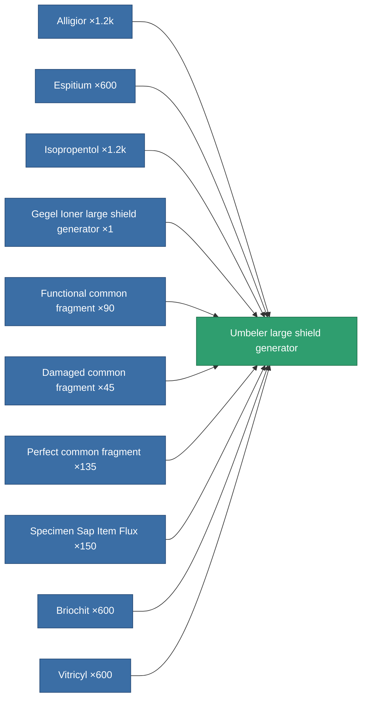

<!-- Generated by tools/generate from the live database (source: entitydefaults definition 731, aggregatevalues via aggregatefields).
     Do not edit by hand; regenerate instead. -->

# Umbeler large shield generator

|  |  |
|---|---|
| Definition | `def_named3_large_shield_generator` |
| Tier | T4 |
| Health | 100 |
| Volume | 1 |
| Mass | 940 |
| Category | Modules / Shield |
| Tier line | [Standard large shield generator](/content/items/standard-large-shield-generator/) (T1) → [AVA-Spintarge large shield generator](/content/items/named1-large-shield-generator/) (T2) → [Gegel Ioner large shield generator](/content/items/named2-large-shield-generator/) (T3) → **Umbeler large shield generator** (T4) |

## Stats

| Field | Value |
|---|---|
| core_usage | 30 |
| cpu_usage | 350 |
| cycle_time | 6.5k |
| powergrid_usage | 1.425k |
| shield_absorbtion | 2.105 |
| shield_radius | 33 |

<!-- production:generated -->
## Production

**Produced from 10 components** — assemble the components to build it (see [Recipes](/content/recipes/) for the full list):

[All items](/content/items/)
