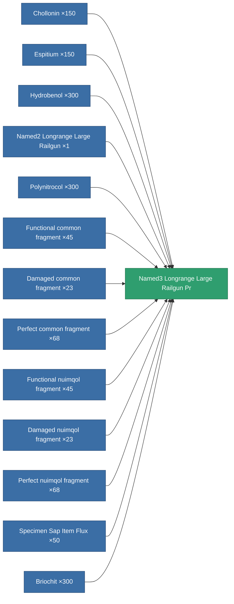

<!-- Generated by tools/generate from the live database (source: entitydefaults definition 5821, aggregatevalues via aggregatefields).
     Do not edit by hand; regenerate instead. -->

# Named3 Longrange Large Railgun Pr

|  |  |
|---|---|
| Definition | `def_named3_longrange_large_railgun_pr` |
| Tier | 4 |
| Health | 100 |
| Volume | 1.5 |
| Mass | 1430 |
| Category | Modules / Weapons |
| Note | large weapon module |

## Stats

| Field | Value |
|---|---|
| accuracy | 42 |
| core_usage | 25.2 |
| cpu_usage | 112.5 |
| cycle_time | 10k |
| damage_modifier | 4.05 |
| falloff | 24 |
| optimal_range | 48 |
| powergrid_usage | 300 |

<!-- production:generated -->
## Production

**Produced from 13 components, research level 8** — assemble the components to build it (see [Recipes](/content/recipes/) for the full list):

[All items](/content/items/)
