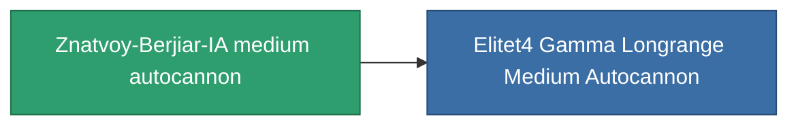

<!-- Generated by tools/generate from the live database (source: entitydefaults definition 1032, aggregatevalues via aggregatefields).
     Do not edit by hand; regenerate instead. -->

# Znatvoy-Berjiar-IA medium autocannon

|  |  |
|---|---|
| Definition | `def_named3_longrange_medium_autocannon` |
| Tier | T4 |
| Health | 100 |
| Volume | 1.2 |
| Mass | 715 |
| Category | Modules / Weapons |
| Tier line | [GTRB medium autocannon](/content/items/named1-longrange-medium-autocannon/) (T2) → [Astoc M75 medium autocannon](/content/items/named2-longrange-medium-autocannon/) (T3) → **Znatvoy-Berjiar-IA medium autocannon** (T4) |

## Stats

| Field | Value |
|---|---|
| accuracy | 18 |
| core_usage | 2 |
| cpu_usage | 14 |
| cycle_time | 9k |
| damage_modifier | 2.7 |
| falloff | 32 |
| least_optimal | 5 |
| optimal_range | 24 |
| powergrid_usage | 150 |

<!-- production:generated -->
## Production

**Produced from 7 components, research level 6** — assemble the components to build it (see [Recipes](/content/recipes/) for the full list):

<svg class="prod-card-icon" aria-hidden="true"><use href="#mi-grid"/></svg><a class="prod-card-name" href="/content/items/axicol/">Cryoperine</a>

required: <b>100</b>

<svg class="prod-card-icon" aria-hidden="true"><use href="#mi-grid"/></svg><a class="prod-card-name" href="/content/items/axicoline/">Axicoline</a>

required: <b>200</b>

<svg class="prod-card-icon" aria-hidden="true"><use href="#mi-grid"/></svg><a class="prod-card-name" href="/content/items/espitium/">Espitium</a>

required: <b>100</b>

<svg class="prod-card-icon" aria-hidden="true"><use href="#mi-grid"/></svg><a class="prod-card-name" href="/content/items/hydrobenol/">Hydrobenol</a>

required: <b>200</b>

<svg class="prod-card-icon" aria-hidden="true"><use href="#mi-robots"/></svg><a class="prod-card-name" href="/content/items/named2-longrange-medium-autocannon/">Astoc M75 medium autocannon</a>

required: <b>1</b>

<svg class="prod-card-icon" aria-hidden="true"><use href="#mi-grid"/></svg><a class="prod-card-name" href="/content/items/titanium/">Titanium</a>

required: <b>100</b>

<svg class="prod-card-icon" aria-hidden="true"><use href="#mi-grid"/></svg><a class="prod-card-name" href="/content/items/unimetal/">Briochit</a>

required: <b>200</b>

## Used in production

**Component of 1 items** — everything that uses it in production:

