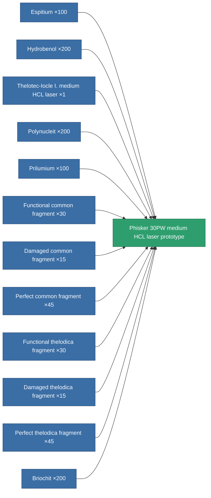

<!-- Generated by tools/generate from the live database (source: entitydefaults definition 2341, aggregatevalues via aggregatefields).
     Do not edit by hand; regenerate instead. -->

# Phisker 30PW medium HCL laser prototype

|  |  |
|---|---|
| Definition | `def_named3_longrange_medium_laser_pr` |
| Tier | 4 |
| Health | 100 |
| Volume | 1 |
| Mass | 715 |
| Category | Modules / Weapons |

## Stats

| Field | Value |
|---|---|
| accuracy | 12 |
| core_usage | 21.6 |
| cpu_usage | 33 |
| cycle_time | 6k |
| damage_modifier | 1.3 |
| falloff | 10 |
| least_optimal | 12 |
| optimal_range | 37.5 |
| powergrid_usage | 238 |

<!-- production:generated -->
## Production

**Produced from 12 components, research level 7** — assemble the components to build it (see [Recipes](/content/recipes/) for the full list):

[All items](/content/items/)
