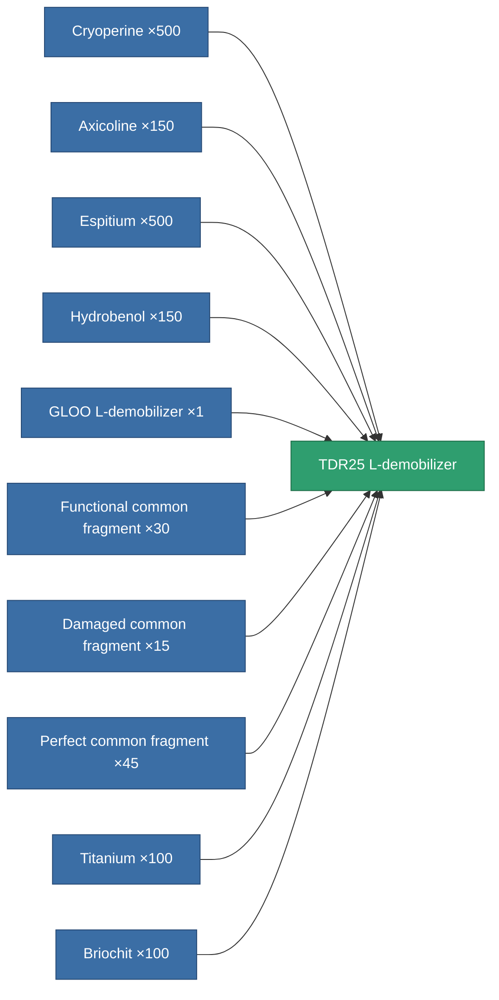

<!-- Generated by tools/generate from the live database (source: entitydefaults definition 3517, aggregatevalues via aggregatefields).
     Do not edit by hand; regenerate instead. -->

# TDR25 L-demobilizer

|  |  |
|---|---|
| Definition | `def_named3_longrange_webber` |
| Tier | T4 |
| Health | 100 |
| Volume | 0.5 |
| Mass | 100 |
| Category | Modules / Enhancements |
| Tier line | [Standard L-demobilizer](/content/items/standard-longrange-webber/) (T1) → [Venom L-demobilizer](/content/items/named1-longrange-webber/) (T2) → [GLOO L-demobilizer](/content/items/named2-longrange-webber/) (T3) → **TDR25 L-demobilizer** (T4) |

## Stats

| Field | Value |
|---|---|
| core_usage | 40 |
| cpu_usage | 60 |
| cycle_time | 5k |
| effect_massivness_speed_max_modifier | 0.97 |
| falloff | 0 |
| optimal_range | 30 |
| powergrid_usage | 15 |

<!-- production:generated -->
## Production

**Produced from 10 components, research level 9** — assemble the components to build it (see [Recipes](/content/recipes/) for the full list):

[All items](/content/items/)
