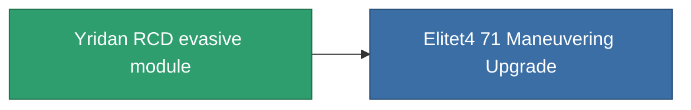

<!-- Generated by tools/generate from the live database (source: entitydefaults definition 2567, aggregatevalues via aggregatefields).
     Do not edit by hand; regenerate instead. -->

# Yridan RCD evasive module

|  |  |
|---|---|
| Definition | `def_named3_maneuvering_upgrade` |
| Tier | 4 |
| Health | 100 |
| Volume | 0.5 |
| Mass | 35 |
| Category | Modules / Enhancements |

## Stats

| Field | Value |
|---|---|
| cpu_usage | 29 |
| massiveness | 0.075 |
| powergrid_usage | 28 |
| signature_radius | -1.15 |

<!-- production:generated -->
## Production

**Component of 1 items** — everything that uses it in production:

[All items](/content/items/)
