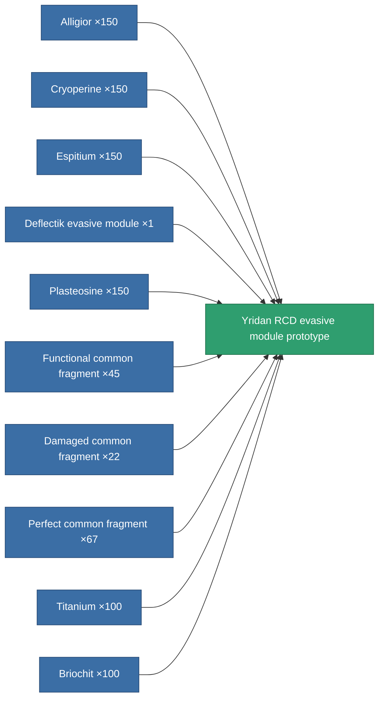

<!-- Generated by tools/generate from the live database (source: entitydefaults definition 2615, aggregatevalues via aggregatefields).
     Do not edit by hand; regenerate instead. -->

# Yridan RCD evasive module prototype

|  |  |
|---|---|
| Definition | `def_named3_maneuvering_upgrade_pr` |
| Tier | 4 |
| Health | 100 |
| Volume | 0.5 |
| Mass | 25 |
| Category | Modules / Enhancements |

## Stats

| Field | Value |
|---|---|
| cpu_usage | 27 |
| massiveness | 0.075 |
| powergrid_usage | 26 |
| signature_radius | -1.2 |

<!-- production:generated -->
## Production

**Produced from 10 components, research level 8** — assemble the components to build it (see [Recipes](/content/recipes/) for the full list):

[All items](/content/items/)
