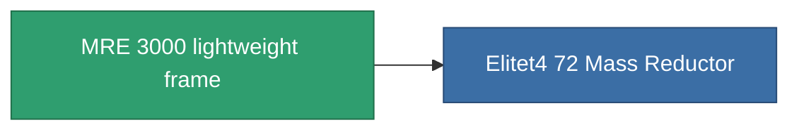

<!-- Generated by tools/generate from the live database (source: entitydefaults definition 1404, aggregatevalues via aggregatefields).
     Do not edit by hand; regenerate instead. -->

# MRE 3000 lightweight frame

|  |  |
|---|---|
| Definition | `def_named3_mass_reductor` |
| Tier | T4 |
| Health | 100 |
| Volume | 0.5 |
| Mass | 2 |
| Category | Modules / Enhancements |
| Tier line | [Standard lightweight frame](/content/items/standard-mass-reductor/) (T1) → [MR1000-Boogey lightweight frame](/content/items/named1-mass-reductor/) (T2) → [Eizbiogh-dfg20 lightweight frame](/content/items/named2-mass-reductor/) (T3) → **MRE 3000 lightweight frame** (T4) |

## Stats

| Field | Value |
|---|---|
| armor_max_modifier | 0.725 |
| cpu_usage | 7 |
| massiveness | -0.25 |
| powergrid_usage | 3 |
| speed_max_modifier | 1.25 |

<!-- production:generated -->
## Production

**Produced from 10 components, research level 6** — assemble the components to build it (see [Recipes](/content/recipes/) for the full list):

<svg class="prod-card-icon" aria-hidden="true"><use href="#mi-grid"/></svg><a class="prod-card-name" href="/content/items/alligior/">Alligior</a>

required: <b>350</b>

<svg class="prod-card-icon" aria-hidden="true"><use href="#mi-grid"/></svg><a class="prod-card-name" href="/content/items/axicol/">Cryoperine</a>

required: <b>50</b>

<svg class="prod-card-icon" aria-hidden="true"><use href="#mi-grid"/></svg><a class="prod-card-name" href="/content/items/espitium/">Espitium</a>

required: <b>50</b>

<svg class="prod-card-icon" aria-hidden="true"><use href="#mi-grid"/></svg><a class="prod-card-name" href="/content/items/named2-mass-reductor/">Eizbiogh-dfg20 lightweight frame</a>

required: <b>1</b>

<svg class="prod-card-icon" aria-hidden="true"><use href="#mi-grid"/></svg><a class="prod-card-name" href="/content/items/plasteosine/">Plasteosine</a>

required: <b>350</b>

<svg class="prod-card-icon" aria-hidden="true"><use href="#mi-crystal"/></svg><a class="prod-card-name" href="/content/items/robotshard-common-advanced/">Functional common fragment</a>

required: <b>30</b>

<svg class="prod-card-icon" aria-hidden="true"><use href="#mi-crystal"/></svg><a class="prod-card-name" href="/content/items/robotshard-common-basic/">Damaged common fragment</a>

required: <b>15</b>

<svg class="prod-card-icon" aria-hidden="true"><use href="#mi-crystal"/></svg><a class="prod-card-name" href="/content/items/robotshard-common-expert/">Perfect common fragment</a>

required: <b>45</b>

<svg class="prod-card-icon" aria-hidden="true"><use href="#mi-grid"/></svg><a class="prod-card-name" href="/content/items/titanium/">Titanium</a>

required: <b>200</b>

<svg class="prod-card-icon" aria-hidden="true"><use href="#mi-grid"/></svg><a class="prod-card-name" href="/content/items/unimetal/">Briochit</a>

required: <b>200</b>

## Used in production

**Component of 1 items** — everything that uses it in production:

