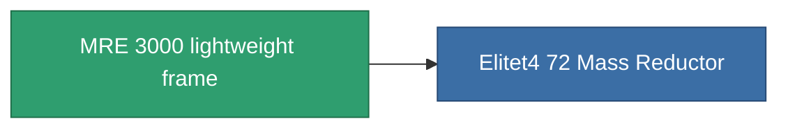

<!-- Generated by tools/generate from the live database (source: entitydefaults definition 1404, aggregatevalues via aggregatefields).
     Do not edit by hand; regenerate instead. -->

# MRE 3000 lightweight frame

|  |  |
|---|---|
| Definition | `def_named3_mass_reductor` |
| Tier | 4 |
| Health | 100 |
| Volume | 0.5 |
| Mass | 2 |
| Category | Modules / Enhancements |

## Stats

| Field | Value |
|---|---|
| armor_max_modifier | 0.725 |
| cpu_usage | 7 |
| massiveness | -0.25 |
| powergrid_usage | 3 |
| speed_max_modifier | 1.25 |

<!-- production:generated -->
## Production

**Component of 1 items** — everything that uses it in production:

[All items](/content/items/)
