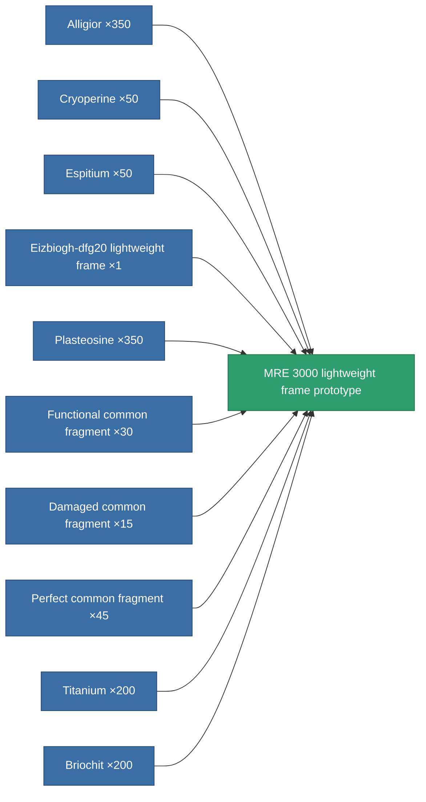

<!-- Generated by tools/generate from the live database (source: entitydefaults definition 2350, aggregatevalues via aggregatefields).
     Do not edit by hand; regenerate instead. -->

# MRE 3000 lightweight frame prototype

|  |  |
|---|---|
| Definition | `def_named3_mass_reductor_pr` |
| Tier | T4 (prototype) |
| Health | 100 |
| Volume | 0.5 |
| Mass | 1.5 |
| Category | Modules / Enhancements |
| Tier line | [Standard lightweight frame](/content/items/standard-mass-reductor/) (T1) → [MR1000-Boogey lightweight frame](/content/items/named1-mass-reductor/) (T2) → [Eizbiogh-dfg20 lightweight frame](/content/items/named2-mass-reductor/) (T3) → [MRE 3000 lightweight frame](/content/items/named3-mass-reductor/) (T4) → **MRE 3000 lightweight frame prototype** (T4) |

## Stats

| Field | Value |
|---|---|
| armor_max_modifier | 0.735 |
| cpu_usage | 7 |
| massiveness | -0.25 |
| powergrid_usage | 3 |
| speed_max_modifier | 1.25 |

<!-- production:generated -->
## Production

**Produced from 10 components, research level 6** — assemble the components to build it (see [Recipes](/content/recipes/) for the full list):

[All items](/content/items/)
