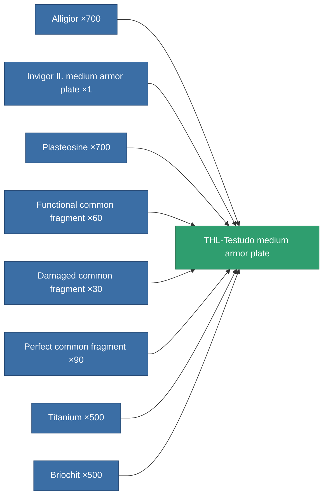

<!-- Generated by tools/generate from the live database (source: entitydefaults definition 689, aggregatevalues via aggregatefields).
     Do not edit by hand; regenerate instead. -->

# THL-Testudo medium armor plate

|  |  |
|---|---|
| Definition | `def_named3_medium_armor_plate` |
| Tier | T4 |
| Health | 100 |
| Volume | 2 |
| Mass | 3350 |
| Category | Modules / Armor |
| Tier line | [Standard medium armor plate](/content/items/standard-medium-armor-plate/) (T1) → [Azilo-Protec Duoforge medium armor plate](/content/items/named1-medium-armor-plate/) (T2) → [Invigor II. medium armor plate](/content/items/named2-medium-armor-plate/) (T3) → **THL-Testudo medium armor plate** (T4) |

## Stats

| Field | Value |
|---|---|
| armor_max | 1.575k |
| cpu_usage | 2 |
| massiveness | 0.15 |
| powergrid_usage | 85 |
| signature_radius | 1 |

<!-- production:generated -->
## Production

**Produced from 8 components, research level 6** — assemble the components to build it (see [Recipes](/content/recipes/) for the full list):

[All items](/content/items/)
