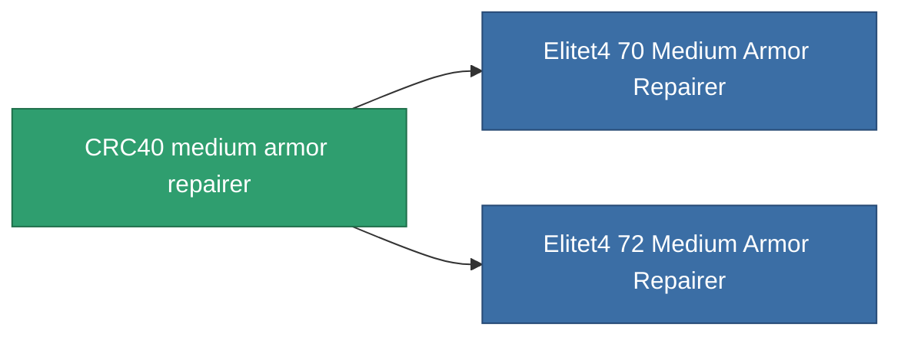

<!-- Generated by tools/generate from the live database (source: entitydefaults definition 698, aggregatevalues via aggregatefields).
     Do not edit by hand; regenerate instead. -->

# CRC40 medium armor repairer

|  |  |
|---|---|
| Definition | `def_named3_medium_armor_repairer` |
| Tier | 4 |
| Health | 100 |
| Volume | 1.5 |
| Mass | 800 |
| Category | Modules / Repair |

## Stats

| Field | Value |
|---|---|
| armor_repair_amount | 230 |
| core_usage | 330 |
| cpu_usage | 55 |
| cycle_time | 12k |
| powergrid_usage | 110 |

<!-- production:generated -->
## Production

**Component of 2 items** — everything that uses it in production:

[All items](/content/items/)
