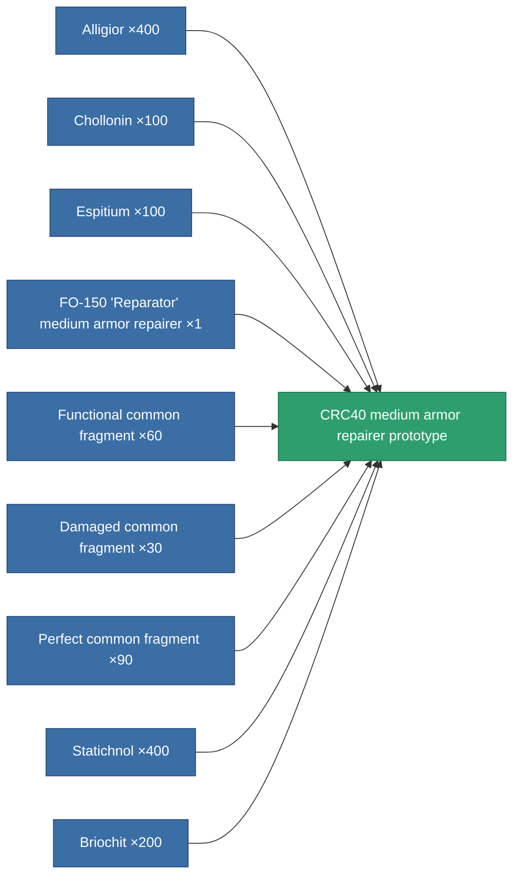

<!-- Generated by tools/generate from the live database (source: entitydefaults definition 2185, aggregatevalues via aggregatefields).
     Do not edit by hand; regenerate instead. -->

# CRC40 medium armor repairer prototype

|  |  |
|---|---|
| Definition | `def_named3_medium_armor_repairer_pr` |
| Tier | T4 (prototype) |
| Health | 100 |
| Volume | 1.5 |
| Mass | 600 |
| Category | Modules / Repair |
| Tier line | [Standard medium armor repairer](/content/items/standard-medium-armor-repairer/) (T1) → [Vautrell medium armor repairer](/content/items/named1-medium-armor-repairer/) (T2) → [FO-150 'Reparator' medium armor repairer](/content/items/named2-medium-armor-repairer/) (T3) → [CRC40 medium armor repairer](/content/items/named3-medium-armor-repairer/) (T4) → **CRC40 medium armor repairer prototype** (T4) |

## Stats

| Field | Value |
|---|---|
| armor_repair_amount | 230 |
| core_usage | 297 |
| cpu_usage | 52 |
| cycle_time | 12k |
| powergrid_usage | 105 |

<!-- production:generated -->
## Production

**Produced from 9 components, research level 7** — assemble the components to build it (see [Recipes](/content/recipes/) for the full list):

[All items](/content/items/)
