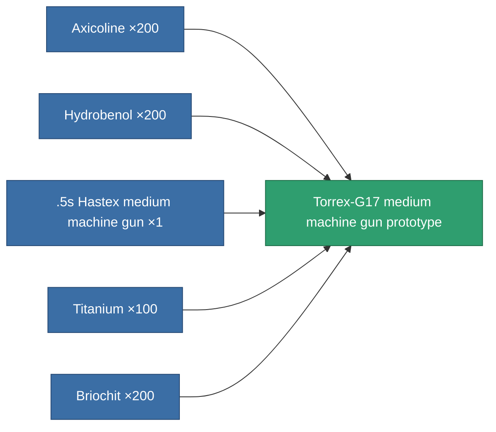

<!-- Generated by tools/generate from the live database (source: entitydefaults definition 2305, aggregatevalues via aggregatefields).
     Do not edit by hand; regenerate instead. -->

# Torrex-G17 medium machine gun prototype

|  |  |
|---|---|
| Definition | `def_named3_medium_autocannon_pr` |
| Tier | T4 (prototype) |
| Health | 100 |
| Volume | 1.2 |
| Mass | 550 |
| Category | Modules / Weapons |
| Tier line | [Standard medium machine gun](/content/items/standard-medium-autocannon/) (T1) → [Grenber 28d medium machine gun](/content/items/named1-medium-autocannon/) (T2) → [.5s Hastex medium machine gun](/content/items/named2-medium-autocannon/) (T3) → [Torrex-G17 medium machine gun](/content/items/named3-medium-autocannon/) (T4) → **Torrex-G17 medium machine gun prototype** (T4) |

## Stats

| Field | Value |
|---|---|
| accuracy | 17 |
| core_usage | 2 |
| cpu_usage | 12 |
| cycle_time | 3k |
| damage_modifier | 1.35 |
| falloff | 18.5 |
| least_optimal | 2 |
| optimal_range | 15 |
| powergrid_usage | 133 |

<!-- production:generated -->
## Production

**Produced from 5 components, research level 6** — assemble the components to build it (see [Recipes](/content/recipes/) for the full list):

[All items](/content/items/)
