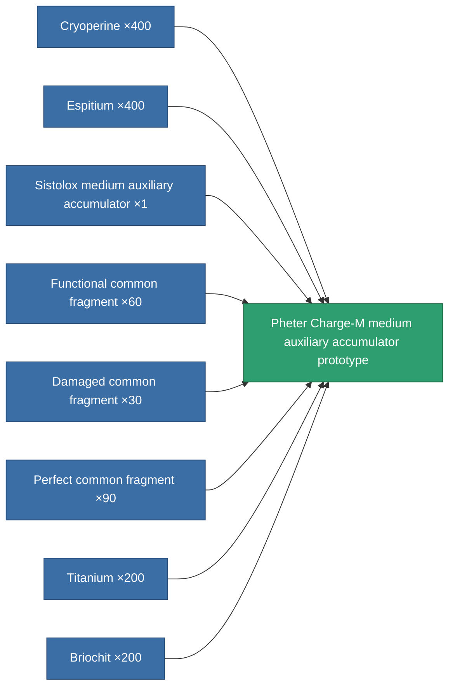

<!-- Generated by tools/generate from the live database (source: entitydefaults definition 2287, aggregatevalues via aggregatefields).
     Do not edit by hand; regenerate instead. -->

# Pheter Charge-M medium auxiliary accumulator prototype

|  |  |
|---|---|
| Definition | `def_named3_medium_core_battery_pr` |
| Tier | T4 (prototype) |
| Health | 100 |
| Volume | 1 |
| Mass | 1500 |
| Category | Modules / Power |
| Tier line | [Standard medium auxiliary accumulator](/content/items/standard-medium-core-battery/) (T1) → [Ovostec-gpc7000 medium auxiliary accumulator](/content/items/named1-medium-core-battery/) (T2) → [Sistolox medium auxiliary accumulator](/content/items/named2-medium-core-battery/) (T3) → [Pheter Charge-M medium auxiliary accumulator](/content/items/named3-medium-core-battery/) (T4) → **Pheter Charge-M medium auxiliary accumulator prototype** (T4) |

## Stats

| Field | Value |
|---|---|
| core_max | 455 |
| cpu_usage | 44 |
| powergrid_usage | 105 |

<!-- production:generated -->
## Production

**Produced from 8 components, research level 7** — assemble the components to build it (see [Recipes](/content/recipes/) for the full list):

[All items](/content/items/)
