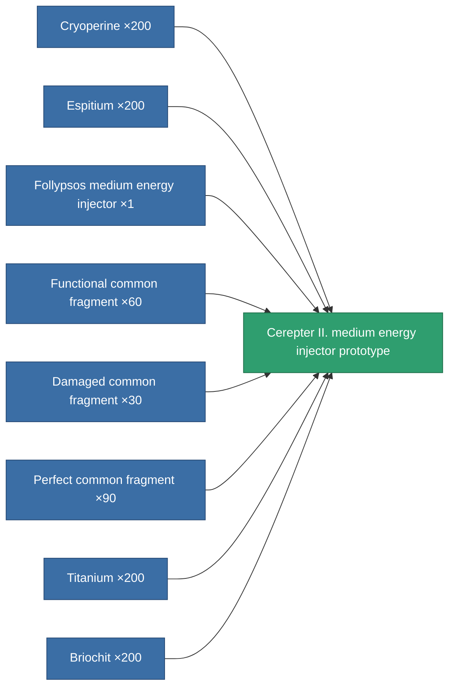

<!-- Generated by tools/generate from the live database (source: entitydefaults definition 2293, aggregatevalues via aggregatefields).
     Do not edit by hand; regenerate instead. -->

# Cerepter II. medium energy injector prototype

|  |  |
|---|---|
| Definition | `def_named3_medium_core_booster_pr` |
| Tier | T4 (prototype) |
| Health | 100 |
| Volume | 1 |
| Mass | 150 |
| Category | Modules / Enhancements |
| Tier line | [Standard medium energy injector](/content/items/standard-medium-core-booster/) (T1) → [Shoxit Parter I. medium energy injector](/content/items/named1-medium-core-booster/) (T2) → [Follypsos medium energy injector](/content/items/named2-medium-core-booster/) (T3) → [Cerepter II. medium energy injector](/content/items/named3-medium-core-booster/) (T4) → **Cerepter II. medium energy injector prototype** (T4) |

## Stats

| Field | Value |
|---|---|
| core_usage | 0 |
| cpu_usage | 26 |
| cycle_time | 9k |
| powergrid_usage | 285 |

<!-- production:generated -->
## Production

**Produced from 8 components, research level 7** — assemble the components to build it (see [Recipes](/content/recipes/) for the full list):

[All items](/content/items/)
