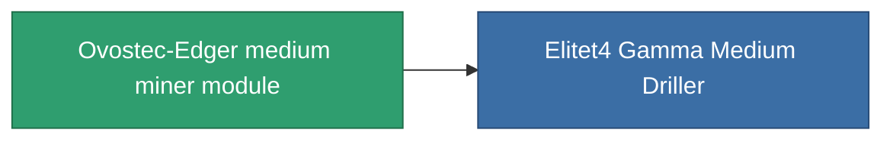

<!-- Generated by tools/generate from the live database (source: entitydefaults definition 803, aggregatevalues via aggregatefields).
     Do not edit by hand; regenerate instead. -->

# Ovostec-Edger medium miner module

|  |  |
|---|---|
| Definition | `def_named3_medium_driller` |
| Tier | 4 |
| Health | 100 |
| Volume | 1.5 |
| Mass | 1000 |
| Category | Modules / Enhancements |

## Stats

| Field | Value |
|---|---|
| core_usage | 65 |
| cpu_usage | 55 |
| cycle_time | 10k |
| optimal_range | 3 |
| powergrid_usage | 170 |

<!-- production:generated -->
## Production

**Component of 1 items** — everything that uses it in production:

[All items](/content/items/)
