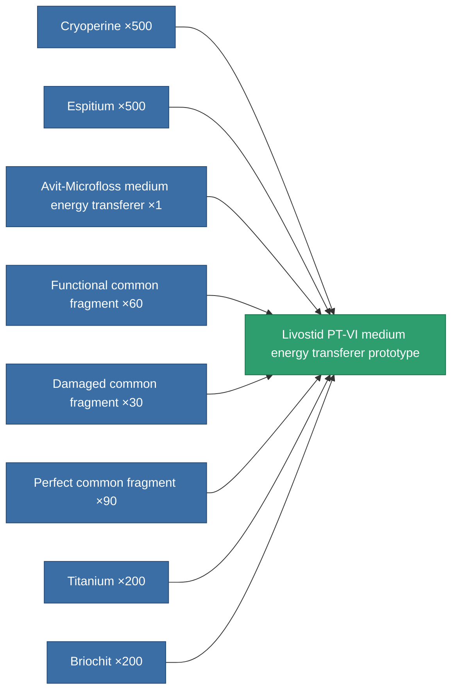

<!-- Generated by tools/generate from the live database (source: entitydefaults definition 2218, aggregatevalues via aggregatefields).
     Do not edit by hand; regenerate instead. -->

# Livostid PT-VI medium energy transferer prototype

|  |  |
|---|---|
| Definition | `def_named3_medium_energy_transfer_pr` |
| Tier | T4 (prototype) |
| Health | 100 |
| Volume | 1 |
| Mass | 375 |
| Category | Modules / Enhancements |
| Tier line | [Standard medium energy transferer](/content/items/standard-medium-energy-transfer/) (T1) → [CDC-Yamp medium energy transferer](/content/items/named1-medium-energy-transfer/) (T2) → [Avit-Microfloss medium energy transferer](/content/items/named2-medium-energy-transfer/) (T3) → [Livostid PT-VI medium energy transferer](/content/items/named3-medium-energy-transfer/) (T4) → **Livostid PT-VI medium energy transferer prototype** (T4) |

## Stats

| Field | Value |
|---|---|
| core_usage | 9 |
| cpu_usage | 47 |
| cycle_time | 10k |
| energy_transfer_amount | 250 |
| falloff | 0 |
| optimal_range | 35 |
| powergrid_usage | 166 |

<!-- production:generated -->
## Production

**Produced from 8 components, research level 7** — assemble the components to build it (see [Recipes](/content/recipes/) for the full list):

[All items](/content/items/)
