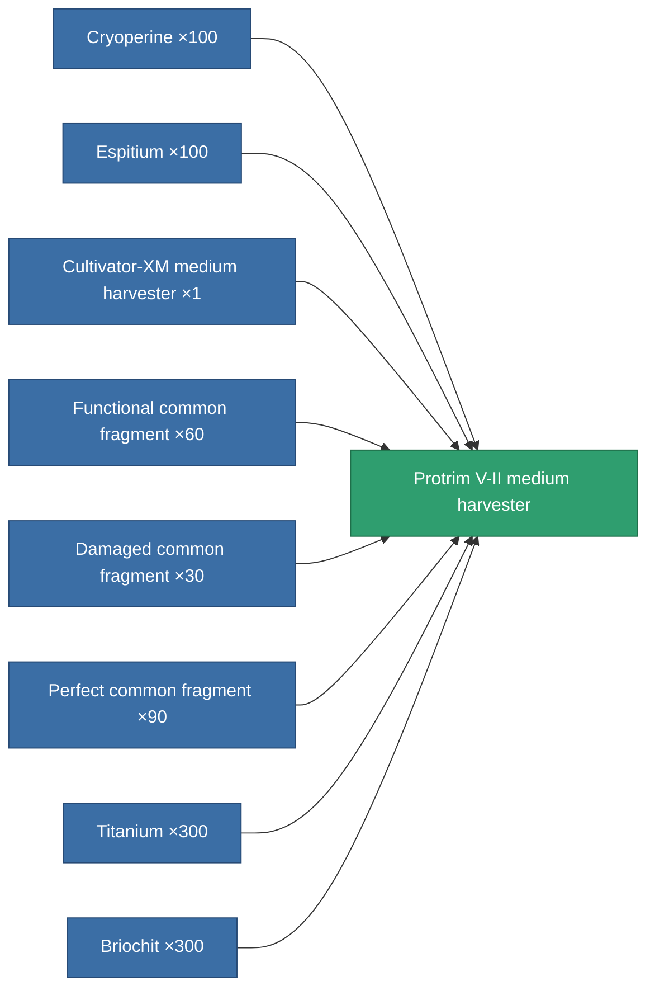
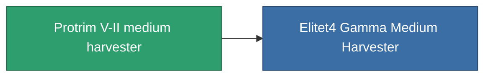

<!-- Generated by tools/generate from the live database (source: entitydefaults definition 812, aggregatevalues via aggregatefields).
     Do not edit by hand; regenerate instead. -->

# Protrim V-II medium harvester

|  |  |
|---|---|
| Definition | `def_named3_medium_harvester` |
| Tier | T4 |
| Health | 100 |
| Volume | 1.5 |
| Mass | 1000 |
| Category | Modules / Harvesting |
| Tier line | [Standard medium harvester](/content/items/standard-medium-harvester/) (T1) → [MHA 900-'Sap' medium harvester](/content/items/named1-medium-harvester/) (T2) → [Cultivator-XM medium harvester](/content/items/named2-medium-harvester/) (T3) → **Protrim V-II medium harvester** (T4) |

## Stats

| Field | Value |
|---|---|
| core_usage | 65 |
| cpu_usage | 55 |
| cycle_time | 10k |
| optimal_range | 3 |
| powergrid_usage | 165 |

<!-- production:generated -->
## Production

**Produced from 8 components, research level 6** — assemble the components to build it (see [Recipes](/content/recipes/) for the full list):

## Used in production

**Component of 1 items** — everything that uses it in production:

[All items](/content/items/)
