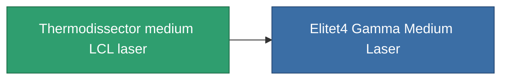

<!-- Generated by tools/generate from the live database (source: entitydefaults definition 836, aggregatevalues via aggregatefields).
     Do not edit by hand; regenerate instead. -->

# Thermodissector medium LCL laser

|  |  |
|---|---|
| Definition | `def_named3_medium_laser` |
| Tier | T4 |
| Health | 100 |
| Volume | 1 |
| Mass | 550 |
| Category | Modules / Weapons |
| Tier line | [Standard medium LCL laser](/content/items/standard-medium-laser/) (T1) → [Thelotec-Grazier medium LCL laser](/content/items/named1-medium-laser/) (T2) → [Kauska Heatpin I. medium LCL laser](/content/items/named2-medium-laser/) (T3) → **Thermodissector medium LCL laser** (T4) |

## Stats

| Field | Value |
|---|---|
| accuracy | 11.5 |
| core_usage | 19.2 |
| cpu_usage | 30 |
| cycle_time | 5k |
| damage_modifier | 1.6 |
| falloff | 10 |
| least_optimal | 6 |
| optimal_range | 19 |
| powergrid_usage | 250 |

<!-- production:generated -->
## Production

**Produced from 10 components, research level 7** — assemble the components to build it (see [Recipes](/content/recipes/) for the full list):

<svg class="prod-card-icon" aria-hidden="true"><use href="#mi-grid"/></svg><a class="prod-card-name" href="/content/items/hydrobenol/">Hydrobenol</a>

required: <b>200</b>

<svg class="prod-card-icon" aria-hidden="true"><use href="#mi-robots"/></svg><a class="prod-card-name" href="/content/items/named2-medium-laser/">Kauska Heatpin I. medium LCL laser</a>

required: <b>1</b>

<svg class="prod-card-icon" aria-hidden="true"><use href="#mi-grid"/></svg><a class="prod-card-name" href="/content/items/polynucleit/">Polynucleit</a>

required: <b>200</b>

<svg class="prod-card-icon" aria-hidden="true"><use href="#mi-crystal"/></svg><a class="prod-card-name" href="/content/items/robotshard-common-advanced/">Functional common fragment</a>

required: <b>30</b>

<svg class="prod-card-icon" aria-hidden="true"><use href="#mi-crystal"/></svg><a class="prod-card-name" href="/content/items/robotshard-common-basic/">Damaged common fragment</a>

required: <b>15</b>

<svg class="prod-card-icon" aria-hidden="true"><use href="#mi-crystal"/></svg><a class="prod-card-name" href="/content/items/robotshard-common-expert/">Perfect common fragment</a>

required: <b>45</b>

<svg class="prod-card-icon" aria-hidden="true"><use href="#mi-crystal"/></svg><a class="prod-card-name" href="/content/items/robotshard-thelodica-advanced/">Functional thelodica fragment</a>

required: <b>30</b>

<svg class="prod-card-icon" aria-hidden="true"><use href="#mi-crystal"/></svg><a class="prod-card-name" href="/content/items/robotshard-thelodica-basic/">Damaged thelodica fragment</a>

required: <b>15</b>

<svg class="prod-card-icon" aria-hidden="true"><use href="#mi-crystal"/></svg><a class="prod-card-name" href="/content/items/robotshard-thelodica-expert/">Perfect thelodica fragment</a>

required: <b>45</b>

<svg class="prod-card-icon" aria-hidden="true"><use href="#mi-grid"/></svg><a class="prod-card-name" href="/content/items/unimetal/">Briochit</a>

required: <b>200</b>

## Used in production

**Component of 1 items** — everything that uses it in production:

