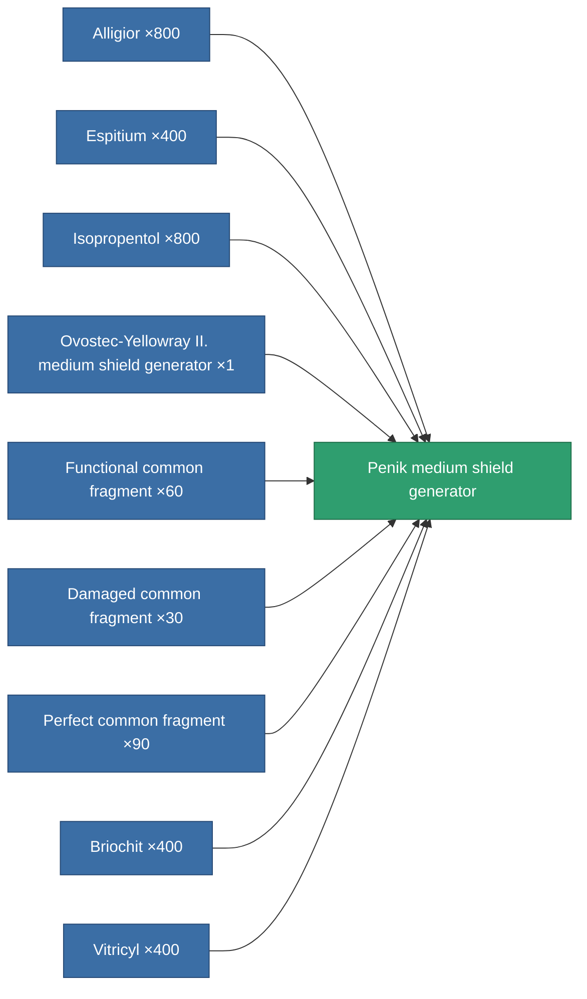
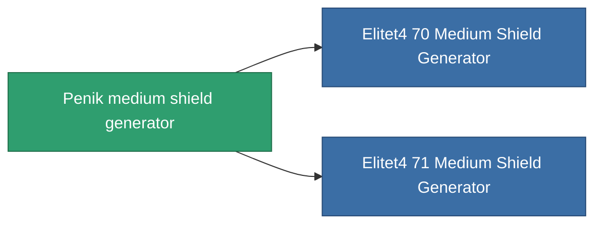

<!-- Generated by tools/generate from the live database (source: entitydefaults definition 728, aggregatevalues via aggregatefields).
     Do not edit by hand; regenerate instead. -->

# Penik medium shield generator

|  |  |
|---|---|
| Definition | `def_named3_medium_shield_generator` |
| Tier | 4 |
| Health | 100 |
| Volume | 0.5 |
| Mass | 470 |
| Category | Modules / Shield |

## Stats

| Field | Value |
|---|---|
| core_usage | 12.5 |
| cpu_usage | 70 |
| cycle_time | 6.5k |
| powergrid_usage | 285 |
| shield_absorbtion | 2 |
| shield_radius | 25 |

<!-- production:generated -->
## Production

**Produced from 9 components, research level 7** — assemble the components to build it (see [Recipes](/content/recipes/) for the full list):

## Used in production

**Component of 2 items** — everything that uses it in production:

[All items](/content/items/)
