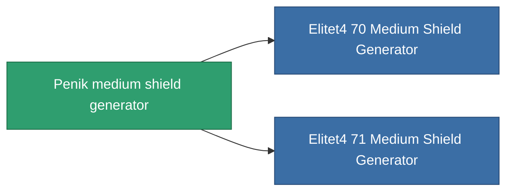

<!-- Generated by tools/generate from the live database (source: entitydefaults definition 728, aggregatevalues via aggregatefields).
     Do not edit by hand; regenerate instead. -->

# Penik medium shield generator

|  |  |
|---|---|
| Definition | `def_named3_medium_shield_generator` |
| Tier | T4 |
| Health | 100 |
| Volume | 0.5 |
| Mass | 470 |
| Category | Modules / Shield |
| Tier line | [Standard medium shield generator](/content/items/standard-medium-shield-generator/) (T1) → [Parsvaal-IIX medium shield generator](/content/items/named1-medium-shield-generator/) (T2) → [Ovostec-Yellowray II. medium shield generator](/content/items/named2-medium-shield-generator/) (T3) → **Penik medium shield generator** (T4) |

## Stats

| Field | Value |
|---|---|
| core_usage | 12.5 |
| cpu_usage | 70 |
| cycle_time | 6.5k |
| powergrid_usage | 285 |
| shield_absorbtion | 2 |
| shield_radius | 25 |

<!-- production:generated -->
## Production

**Produced from 9 components, research level 7** — assemble the components to build it (see [Recipes](/content/recipes/) for the full list):

<svg class="prod-card-icon" aria-hidden="true"><use href="#mi-grid"/></svg><a class="prod-card-name" href="/content/items/alligior/">Alligior</a>

required: <b>800</b>

<svg class="prod-card-icon" aria-hidden="true"><use href="#mi-grid"/></svg><a class="prod-card-name" href="/content/items/espitium/">Espitium</a>

required: <b>400</b>

<svg class="prod-card-icon" aria-hidden="true"><use href="#mi-grid"/></svg><a class="prod-card-name" href="/content/items/isopropentol/">Isopropentol</a>

required: <b>800</b>

<svg class="prod-card-icon" aria-hidden="true"><use href="#mi-tree"/></svg><a class="prod-card-name" href="/content/items/named2-medium-shield-generator/">Ovostec-Yellowray II. medium shield generator</a>

required: <b>1</b>

<svg class="prod-card-icon" aria-hidden="true"><use href="#mi-crystal"/></svg><a class="prod-card-name" href="/content/items/robotshard-common-advanced/">Functional common fragment</a>

required: <b>60</b>

<svg class="prod-card-icon" aria-hidden="true"><use href="#mi-crystal"/></svg><a class="prod-card-name" href="/content/items/robotshard-common-basic/">Damaged common fragment</a>

required: <b>30</b>

<svg class="prod-card-icon" aria-hidden="true"><use href="#mi-crystal"/></svg><a class="prod-card-name" href="/content/items/robotshard-common-expert/">Perfect common fragment</a>

required: <b>90</b>

<svg class="prod-card-icon" aria-hidden="true"><use href="#mi-grid"/></svg><a class="prod-card-name" href="/content/items/unimetal/">Briochit</a>

required: <b>400</b>

<svg class="prod-card-icon" aria-hidden="true"><use href="#mi-grid"/></svg><a class="prod-card-name" href="/content/items/vitricyl/">Vitricyl</a>

required: <b>400</b>

## Used in production

**Component of 2 items** — everything that uses it in production:

