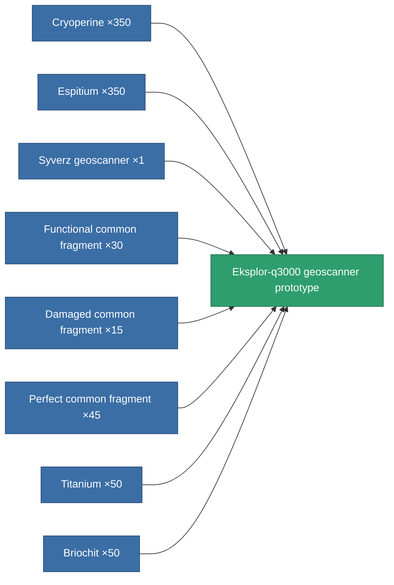

<!-- Generated by tools/generate from the live database (source: entitydefaults definition 2251, aggregatevalues via aggregatefields).
     Do not edit by hand; regenerate instead. -->

# Eksplor-q3000 geoscanner prototype

|  |  |
|---|---|
| Definition | `def_named3_mining_probe_module_pr` |
| Tier | 4 |
| Health | 100 |
| Volume | 1 |
| Mass | 150 |
| Category | Modules / Enhancements |

## Stats

| Field | Value |
|---|---|
| core_usage | 81 |
| cpu_usage | 57 |
| cycle_time | 10k |
| mining_probe_accuracy | 0.7 |
| powergrid_usage | 50 |

<!-- production:generated -->
## Production

**Produced from 8 components, research level 4** — assemble the components to build it (see [Recipes](/content/recipes/) for the full list):

[All items](/content/items/)
