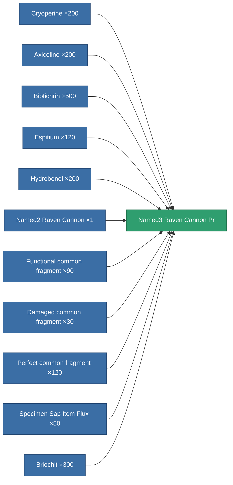

<!-- Generated by tools/generate from the live database (source: entitydefaults definition 8907, aggregatevalues via aggregatefields).
     Do not edit by hand; regenerate instead. -->

# Named3 Raven Cannon Pr

|  |  |
|---|---|
| Definition | `def_named3_raven_cannon_pr` |
| Tier | 4 |
| Health | 100 |
| Volume | 1.8 |
| Mass | 1596 |
| Category | Modules / Weapons |

## Stats

| Field | Value |
|---|---|
| accuracy | 46 |
| core_usage | 1.9 |
| cpu_usage | 79.8 |
| cycle_time | 15k |
| damage_modifier | 1.82 |
| falloff | 50 |
| optimal_range | 42 |
| powergrid_usage | 342 |

<!-- production:generated -->
## Production

**Produced from 11 components, research level 8** — assemble the components to build it (see [Recipes](/content/recipes/) for the full list):

[All items](/content/items/)
