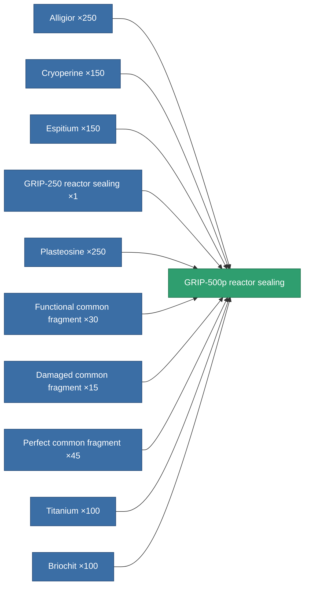

<!-- Generated by tools/generate from the live database (source: entitydefaults definition 4582, aggregatevalues via aggregatefields).
     Do not edit by hand; regenerate instead. -->

# GRIP-500p reactor sealing

|  |  |
|---|---|
| Definition | `def_named3_reactor_sealing` |
| Tier | T4 |
| Health | 100 |
| Volume | 1 |
| Mass | 165 |
| Category | Modules / Enhancements |
| Tier line | [Standard reactor sealing](/content/items/standard-reactor-sealing/) (T1) → [Tortoise reactor sealing](/content/items/named1-reactor-sealing/) (T2) → [GRIP-250 reactor sealing](/content/items/named2-reactor-sealing/) (T3) → **GRIP-500p reactor sealing** (T4) |

## Stats

| Field | Value |
|---|---|
| cpu_usage | 17 |
| powergrid_usage | 85 |
| reactor_radiation_modifier | 0.65 |

<!-- production:generated -->
## Production

**Produced from 10 components, research level 6** — assemble the components to build it (see [Recipes](/content/recipes/) for the full list):

[All items](/content/items/)
