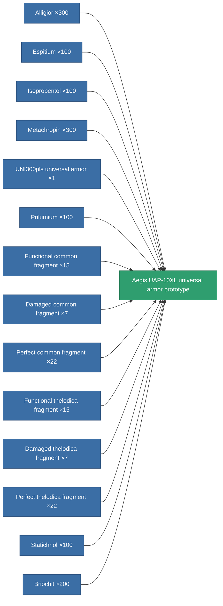

<!-- Generated by tools/generate from the live database (source: entitydefaults definition 2335, aggregatevalues via aggregatefields).
     Do not edit by hand; regenerate instead. -->

# Aegis UAP-10XL universal armor prototype

|  |  |
|---|---|
| Definition | `def_named3_resistant_plating_pr` |
| Tier | 4 |
| Health | 100 |
| Volume | 1.5 |
| Mass | 187.5 |
| Category | Modules / Enhancements |

## Stats

| Field | Value |
|---|---|
| cpu_usage | 38 |
| powergrid_usage | 11 |
| resist_chemical | 36 |
| resist_explosive | 36 |
| resist_kinetic | 36 |
| resist_thermal | 36 |

<!-- production:generated -->
## Production

**Produced from 14 components, research level 6** — assemble the components to build it (see [Recipes](/content/recipes/) for the full list):

[All items](/content/items/)
