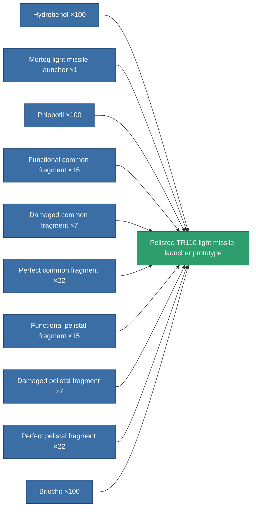

<!-- Generated by tools/generate from the live database (source: entitydefaults definition 2308, aggregatevalues via aggregatefields).
     Do not edit by hand; regenerate instead. -->

# Pelistec-TR110 light missile launcher prototype

|  |  |
|---|---|
| Definition | `def_named3_rocket_launcher_pr` |
| Tier | 4 |
| Health | 100 |
| Volume | 1 |
| Mass | 275 |
| Category | Modules / Weapons |

## Stats

| Field | Value |
|---|---|
| accuracy | 1 |
| core_usage | 1 |
| cpu_usage | 32 |
| cycle_time | 6.5k |
| damage_modifier | 1 |
| module_missile_range_modifier | 1.2 |
| powergrid_usage | 28 |

<!-- production:generated -->
## Production

**Produced from 10 components, research level 5** — assemble the components to build it (see [Recipes](/content/recipes/) for the full list):

[All items](/content/items/)
