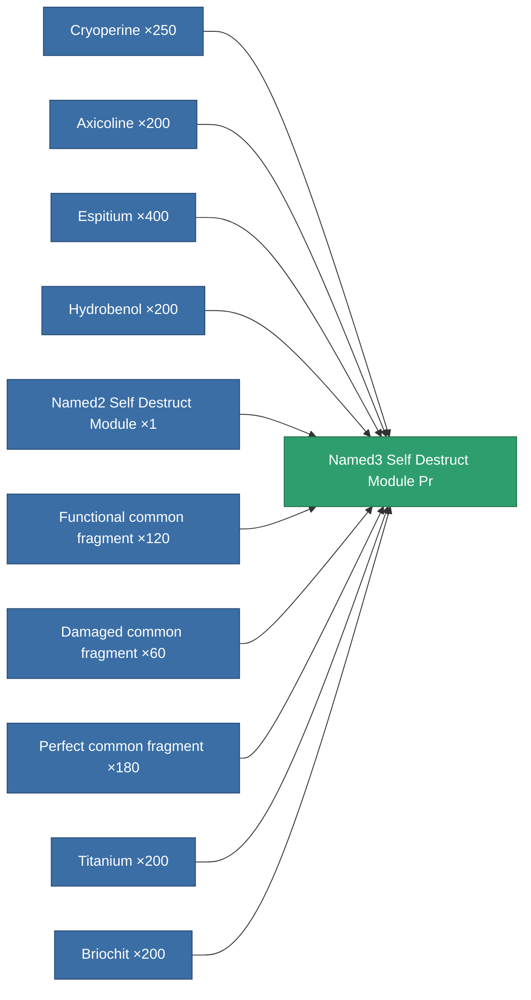

<!-- Generated by tools/generate from the live database (source: entitydefaults definition 8987, aggregatevalues via aggregatefields).
     Do not edit by hand; regenerate instead. -->

# Named3 Self Destruct Module Pr

|  |  |
|---|---|
| Definition | `def_named3_self_destruct_module_pr` |
| Tier | 4 |
| Health | 100 |
| Volume | 100 |
| Mass | 400 |
| Category | Modules / Enhancements |
| Note | Kamikaze self-destruct module: arms an un-cancellable delayed detonation that kills the owner. |

## Stats

| Field | Value |
|---|---|
| core_usage | 65 |
| cpu_usage | 53 |
| powergrid_usage | 25 |

<!-- production:generated -->
## Production

**Produced from 10 components, research level 8** — assemble the components to build it (see [Recipes](/content/recipes/) for the full list):

[All items](/content/items/)
