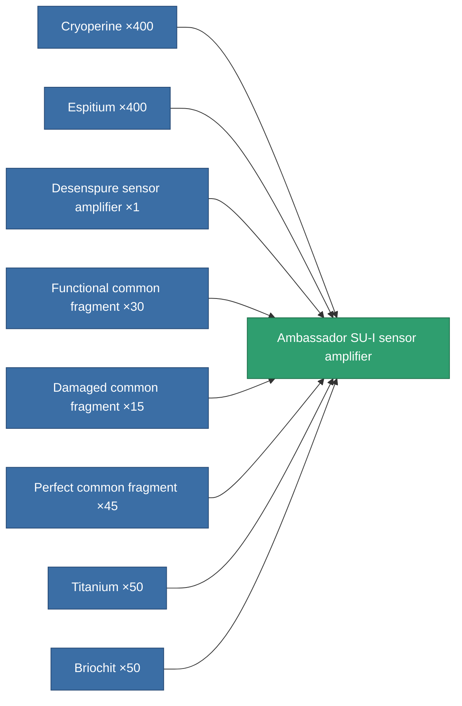

<!-- Generated by tools/generate from the live database (source: entitydefaults definition 770, aggregatevalues via aggregatefields).
     Do not edit by hand; regenerate instead. -->

# Ambassador SU-I sensor amplifier

|  |  |
|---|---|
| Definition | `def_named3_sensor_booster` |
| Tier | 4 |
| Health | 100 |
| Volume | 0.5 |
| Mass | 100 |
| Category | Modules / Sensors & scanning |

## Stats

| Field | Value |
|---|---|
| core_usage | 12 |
| cpu_usage | 19 |
| cycle_time | 10k |
| effect_sensor_booster_locking_range_modifier | 1.45 |
| effect_sensor_booster_locking_time_modifier | 0.7 |
| powergrid_usage | 9 |

<!-- production:generated -->
## Production

**Produced from 8 components, research level 6** — assemble the components to build it (see [Recipes](/content/recipes/) for the full list):

## Used in production

**Component of 1 items** — everything that uses it in production:

[All items](/content/items/)
