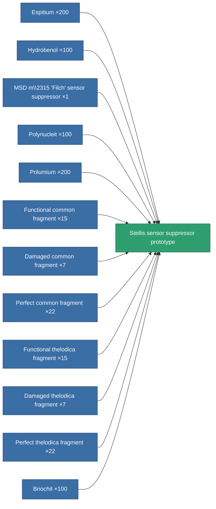

<!-- Generated by tools/generate from the live database (source: entitydefaults definition 2263, aggregatevalues via aggregatefields).
     Do not edit by hand; regenerate instead. -->

# Stellis sensor suppressor prototype

|  |  |
|---|---|
| Definition | `def_named3_sensor_dampener_pr` |
| Tier | 4 |
| Health | 100 |
| Volume | 0.5 |
| Mass | 112.5 |
| Category | Modules / Sensors & scanning |

## Stats

| Field | Value |
|---|---|
| core_usage | 18 |
| cpu_usage | 36 |
| cycle_time | 5k |
| ecm_strength | 70 |
| effect_sensor_dampener_locking_range_modifier | 0.75 |
| effect_sensor_dampener_locking_time_modifier | 1.4 |
| falloff | 0 |
| optimal_range | 35 |
| powergrid_usage | 21 |

<!-- production:generated -->
## Production

**Produced from 12 components, research level 6** — assemble the components to build it (see [Recipes](/content/recipes/) for the full list):

[All items](/content/items/)
