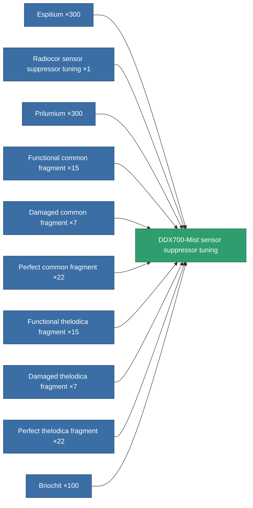

<!-- Generated by tools/generate from the live database (source: entitydefaults definition 4592, aggregatevalues via aggregatefields).
     Do not edit by hand; regenerate instead. -->

# DDX700-Mist sensor suppressor tuning

|  |  |
|---|---|
| Definition | `def_named3_sensor_supressor_booster` |
| Tier | T4 |
| Health | 100 |
| Volume | 0.5 |
| Mass | 165 |
| Category | Modules / Sensors & scanning |
| Tier line | [Standard sensor suppressor tuning](/content/items/standard-sensor-supressor-booster/) (T1) → [DDX200-Veil sensor suppressor tuning](/content/items/named1-sensor-supressor-booster/) (T2) → [Radiocor sensor suppressor tuning](/content/items/named2-sensor-supressor-booster/) (T3) → **DDX700-Mist sensor suppressor tuning** (T4) |

## Stats

| Field | Value |
|---|---|
| core_usage_sensor_dampener_modifier | 1.1 |
| cpu_usage | 55 |
| effect_enhancer_sensor_dampener_locking_range_modifier | 0.9 |
| effect_enhancer_sensor_dampener_locking_time_modifier | 1.175 |
| powergrid_usage | 20 |

<!-- production:generated -->
## Production

**Produced from 10 components, research level 8** — assemble the components to build it (see [Recipes](/content/recipes/) for the full list):

[All items](/content/items/)
