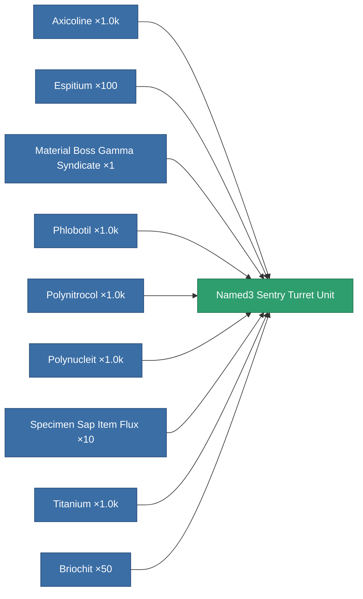

<!-- Generated by tools/generate from the live database (source: entitydefaults definition 8343, aggregatevalues via aggregatefields).
     Do not edit by hand; regenerate instead. -->

# Named3 Sentry Turret Unit

|  |  |
|---|---|
| Definition | `def_named3_sentry_turret_unit` |
| Tier | 4 |
| Health | 100 |
| Volume | 10 |
| Mass | 1 |
| Category | Special & other / Miscellaneous |

## Stats

| Field | Value |
|---|---|
| accuracy | 10.2 |
| armor_max | 7k |
| cycle_time | 2.14k |
| damage_chemical | 24 |
| damage_explosive | 48 |
| damage_kinetic | 48 |
| damage_thermal | 48 |
| damage_toxic | 24 |
| falloff | 5 |
| optimal_range | 20 |
| remote_control_bandwidth_usage | 3 |
| remote_control_lifetime | 300k |
| resist_chemical | 90 |
| resist_explosive | 90 |
| resist_kinetic | 90 |
| resist_thermal | 90 |

<!-- production:generated -->
## Production

**Produced from 9 components, research level 5** — assemble the components to build it (see [Recipes](/content/recipes/) for the full list):

[All items](/content/items/)
