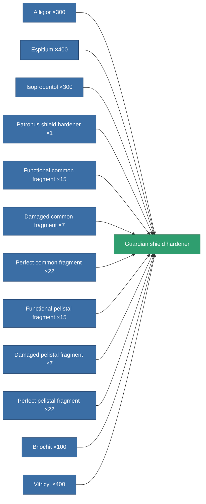

<!-- Generated by tools/generate from the live database (source: entitydefaults definition 734, aggregatevalues via aggregatefields).
     Do not edit by hand; regenerate instead. -->

# Guardian shield hardener

|  |  |
|---|---|
| Definition | `def_named3_shield_hardener` |
| Tier | 4 |
| Health | 100 |
| Volume | 0.5 |
| Mass | 310 |
| Category | Modules / Shield |
| Note | ettol a modultol tud jobban mudkodni a pajzs = kevesebb lesz a core csokkenes |

## Stats

| Field | Value |
|---|---|
| cpu_usage | 55 |
| powergrid_usage | 23 |
| shield_absorbtion_modifier | 1.3 |

<!-- production:generated -->
## Production

**Produced from 12 components, research level 6** — assemble the components to build it (see [Recipes](/content/recipes/) for the full list):

[All items](/content/items/)
