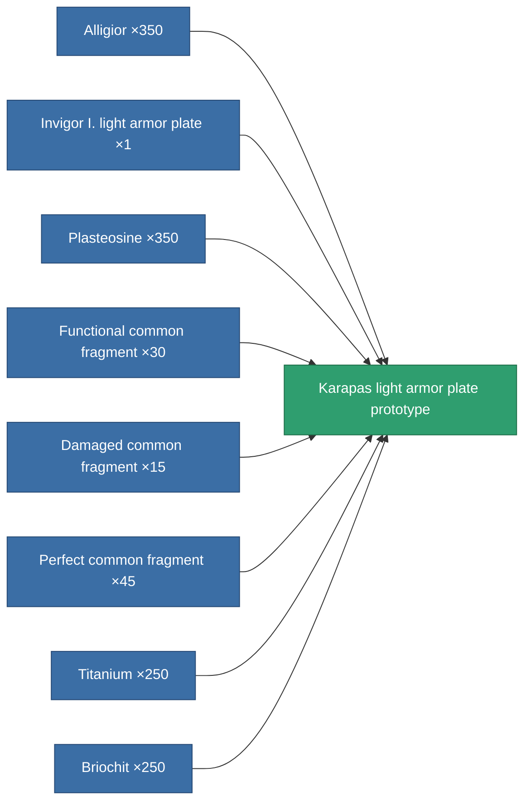

<!-- Generated by tools/generate from the live database (source: entitydefaults definition 2176, aggregatevalues via aggregatefields).
     Do not edit by hand; regenerate instead. -->

# Karapas light armor plate prototype

|  |  |
|---|---|
| Definition | `def_named3_small_armor_plate_pr` |
| Tier | T4 (prototype) |
| Health | 100 |
| Volume | 0.5 |
| Mass | 356.25 |
| Category | Modules / Armor |
| Tier line | [Standard light armor plate](/content/items/standard-small-armor-plate/) (T1) → [Wobost-Titangrip light armor plate](/content/items/named1-small-armor-plate/) (T2) → [Invigor I. light armor plate](/content/items/named2-small-armor-plate/) (T3) → [Karapas light armor plate](/content/items/named3-small-armor-plate/) (T4) → **Karapas light armor plate prototype** (T4) |

## Stats

| Field | Value |
|---|---|
| armor_max | 525 |
| cpu_usage | 1 |
| massiveness | 0.12 |
| powergrid_usage | 15 |
| signature_radius | 0.35 |

<!-- production:generated -->
## Production

**Produced from 8 components, research level 4** — assemble the components to build it (see [Recipes](/content/recipes/) for the full list):

[All items](/content/items/)
