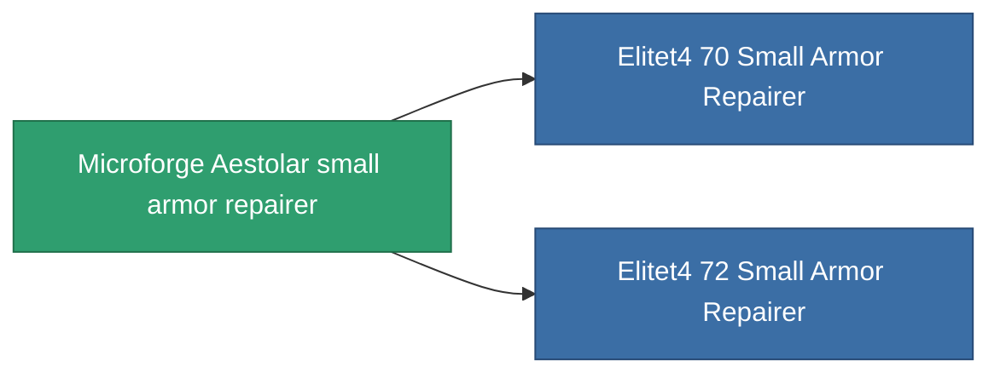

<!-- Generated by tools/generate from the live database (source: entitydefaults definition 695, aggregatevalues via aggregatefields).
     Do not edit by hand; regenerate instead. -->

# Microforge Aestolar small armor repairer

|  |  |
|---|---|
| Definition | `def_named3_small_armor_repairer` |
| Tier | 4 |
| Health | 100 |
| Volume | 1 |
| Mass | 250 |
| Category | Modules / Repair |
| Note | armor_hp += repair_amount * armor_repair_amount_modifier  rof = cycle_time * armor_repair_cycle_time_modifier   |

## Stats

| Field | Value |
|---|---|
| armor_repair_amount | 75 |
| core_usage | 70 |
| cpu_usage | 40 |
| cycle_time | 12k |
| powergrid_usage | 27 |

<!-- production:generated -->
## Production

**Component of 2 items** — everything that uses it in production:

[All items](/content/items/)
