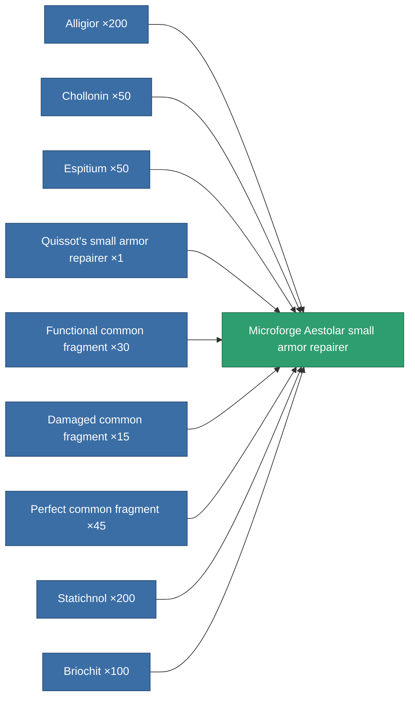
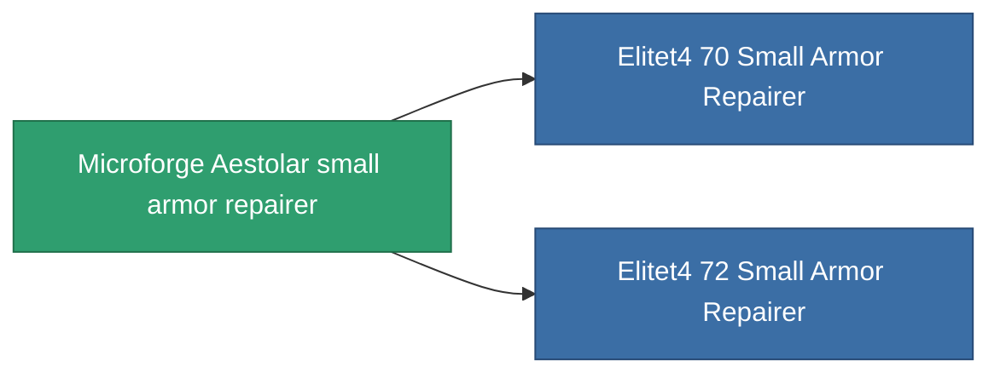

<!-- Generated by tools/generate from the live database (source: entitydefaults definition 695, aggregatevalues via aggregatefields).
     Do not edit by hand; regenerate instead. -->

# Microforge Aestolar small armor repairer

|  |  |
|---|---|
| Definition | `def_named3_small_armor_repairer` |
| Tier | T4 |
| Health | 100 |
| Volume | 1 |
| Mass | 250 |
| Category | Modules / Repair |
| Tier line | [Standard small armor repairer](/content/items/standard-small-armor-repairer/) (T1) → [A150 small armor repairer](/content/items/named1-small-armor-repairer/) (T2) → [Quissot's small armor repairer](/content/items/named2-small-armor-repairer/) (T3) → **Microforge Aestolar small armor repairer** (T4) |
| Note | armor_hp += repair_amount * armor_repair_amount_modifier  rof = cycle_time * armor_repair_cycle_time_modifier   |

## Stats

| Field | Value |
|---|---|
| armor_repair_amount | 75 |
| core_usage | 70 |
| cpu_usage | 40 |
| cycle_time | 12k |
| powergrid_usage | 27 |

<!-- production:generated -->
## Production

**Produced from 9 components, research level 5** — assemble the components to build it (see [Recipes](/content/recipes/) for the full list):

## Used in production

**Component of 2 items** — everything that uses it in production:

[All items](/content/items/)
