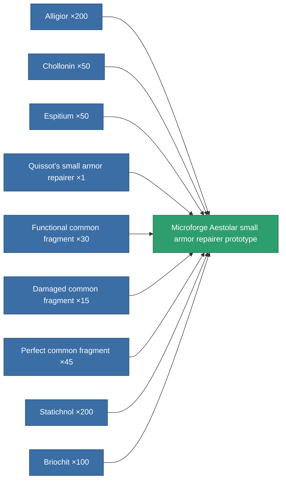

<!-- Generated by tools/generate from the live database (source: entitydefaults definition 2182, aggregatevalues via aggregatefields).
     Do not edit by hand; regenerate instead. -->

# Microforge Aestolar small armor repairer prototype

|  |  |
|---|---|
| Definition | `def_named3_small_armor_repairer_pr` |
| Tier | 4 |
| Health | 100 |
| Volume | 1 |
| Mass | 187.5 |
| Category | Modules / Repair |

## Stats

| Field | Value |
|---|---|
| armor_repair_amount | 75 |
| core_usage | 63 |
| cpu_usage | 38 |
| cycle_time | 12k |
| powergrid_usage | 26 |

<!-- production:generated -->
## Production

**Produced from 9 components, research level 5** — assemble the components to build it (see [Recipes](/content/recipes/) for the full list):

[All items](/content/items/)
