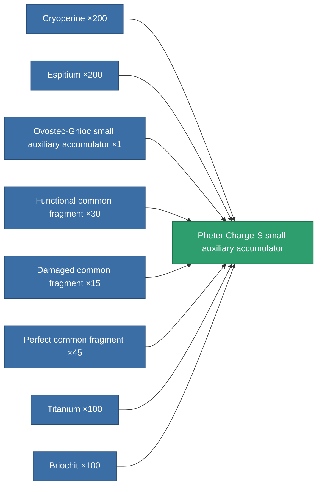

<!-- Generated by tools/generate from the live database (source: entitydefaults definition 815, aggregatevalues via aggregatefields).
     Do not edit by hand; regenerate instead. -->

# Pheter Charge-S small auxiliary accumulator

|  |  |
|---|---|
| Definition | `def_named3_small_core_battery` |
| Tier | T4 |
| Health | 100 |
| Volume | 0.5 |
| Mass | 100 |
| Category | Modules / Power |
| Tier line | [Standard small auxiliary accumulator](/content/items/standard-small-core-battery/) (T1) → [Co-Fuse small auxiliary accumulator](/content/items/named1-small-core-battery/) (T2) → [Ovostec-Ghioc small auxiliary accumulator](/content/items/named2-small-core-battery/) (T3) → **Pheter Charge-S small auxiliary accumulator** (T4) |

## Stats

| Field | Value |
|---|---|
| core_max | 100 |
| cpu_usage | 39 |
| powergrid_usage | 16 |

<!-- production:generated -->
## Production

**Produced from 8 components, research level 6** — assemble the components to build it (see [Recipes](/content/recipes/) for the full list):

[All items](/content/items/)
