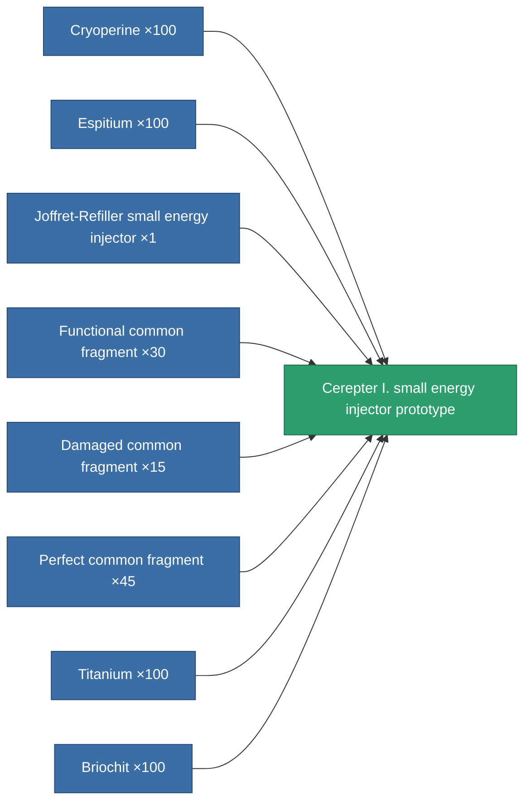

<!-- Generated by tools/generate from the live database (source: entitydefaults definition 2290, aggregatevalues via aggregatefields).
     Do not edit by hand; regenerate instead. -->

# Cerepter I. small energy injector prototype

|  |  |
|---|---|
| Definition | `def_named3_small_core_booster_pr` |
| Tier | T4 (prototype) |
| Health | 100 |
| Volume | 0.5 |
| Mass | 75 |
| Category | Modules / Enhancements |
| Tier line | [Standard small energy injector](/content/items/standard-small-core-booster/) (T1) → [CC25-Veo small energy injector](/content/items/named1-small-core-booster/) (T2) → [Joffret-Refiller small energy injector](/content/items/named2-small-core-booster/) (T3) → [Cerepter I. small energy injector](/content/items/named3-small-core-booster/) (T4) → **Cerepter I. small energy injector prototype** (T4) |

## Stats

| Field | Value |
|---|---|
| core_usage | 0 |
| cpu_usage | 21 |
| cycle_time | 17k |
| powergrid_usage | 57 |

<!-- production:generated -->
## Production

**Produced from 8 components, research level 5** — assemble the components to build it (see [Recipes](/content/recipes/) for the full list):

[All items](/content/items/)
