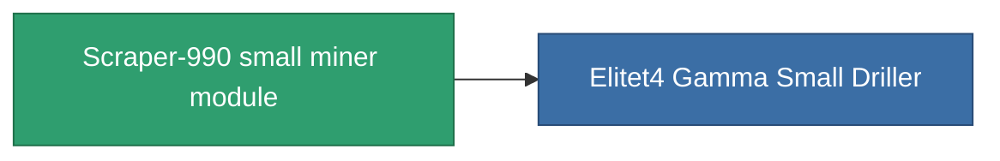

<!-- Generated by tools/generate from the live database (source: entitydefaults definition 800, aggregatevalues via aggregatefields).
     Do not edit by hand; regenerate instead. -->

# Scraper-990 small miner module

|  |  |
|---|---|
| Definition | `def_named3_small_driller` |
| Tier | T4 |
| Health | 100 |
| Volume | 1 |
| Mass | 400 |
| Category | Modules / Enhancements |
| Tier line | [Standard small miner module](/content/items/standard-small-driller/) (T1) → [Biroter 5050 small miner module](/content/items/named1-small-driller/) (T2) → [Sublimator Low-D small miner module](/content/items/named2-small-driller/) (T3) → **Scraper-990 small miner module** (T4) |

## Stats

| Field | Value |
|---|---|
| core_usage | 22 |
| cpu_usage | 45 |
| cycle_time | 12.5k |
| optimal_range | 3 |
| powergrid_usage | 33 |

<!-- production:generated -->
## Production

**Produced from 8 components, research level 4** — assemble the components to build it (see [Recipes](/content/recipes/) for the full list):

<svg class="prod-card-icon" aria-hidden="true"><use href="#mi-grid"/></svg><a class="prod-card-name" href="/content/items/axicol/">Cryoperine</a>

required: <b>50</b>

<svg class="prod-card-icon" aria-hidden="true"><use href="#mi-grid"/></svg><a class="prod-card-name" href="/content/items/espitium/">Espitium</a>

required: <b>50</b>

<svg class="prod-card-icon" aria-hidden="true"><use href="#mi-panel"/></svg><a class="prod-card-name" href="/content/items/named2-small-driller/">Sublimator Low-D small miner module</a>

required: <b>1</b>

<svg class="prod-card-icon" aria-hidden="true"><use href="#mi-crystal"/></svg><a class="prod-card-name" href="/content/items/robotshard-common-advanced/">Functional common fragment</a>

required: <b>30</b>

<svg class="prod-card-icon" aria-hidden="true"><use href="#mi-crystal"/></svg><a class="prod-card-name" href="/content/items/robotshard-common-basic/">Damaged common fragment</a>

required: <b>15</b>

<svg class="prod-card-icon" aria-hidden="true"><use href="#mi-crystal"/></svg><a class="prod-card-name" href="/content/items/robotshard-common-expert/">Perfect common fragment</a>

required: <b>45</b>

<svg class="prod-card-icon" aria-hidden="true"><use href="#mi-grid"/></svg><a class="prod-card-name" href="/content/items/titanium/">Titanium</a>

required: <b>150</b>

<svg class="prod-card-icon" aria-hidden="true"><use href="#mi-grid"/></svg><a class="prod-card-name" href="/content/items/unimetal/">Briochit</a>

required: <b>150</b>

## Used in production

**Component of 1 items** — everything that uses it in production:

