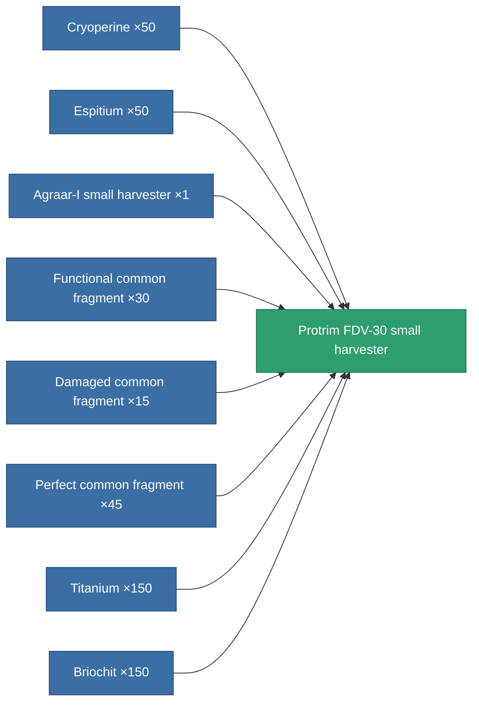
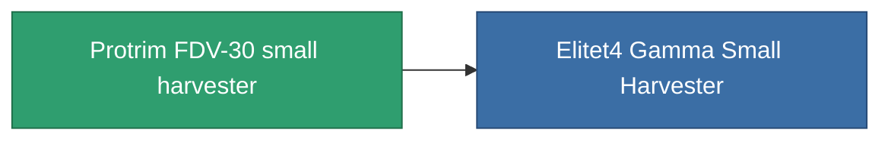

<!-- Generated by tools/generate from the live database (source: entitydefaults definition 809, aggregatevalues via aggregatefields).
     Do not edit by hand; regenerate instead. -->

# Protrim FDV-30 small harvester

|  |  |
|---|---|
| Definition | `def_named3_small_harvester` |
| Tier | 4 |
| Health | 100 |
| Volume | 1 |
| Mass | 400 |
| Category | Modules / Harvesting |

## Stats

| Field | Value |
|---|---|
| core_usage | 22 |
| cpu_usage | 44 |
| cycle_time | 12.5k |
| optimal_range | 3 |
| powergrid_usage | 33 |

<!-- production:generated -->
## Production

**Produced from 8 components, research level 4** — assemble the components to build it (see [Recipes](/content/recipes/) for the full list):

## Used in production

**Component of 1 items** — everything that uses it in production:

[All items](/content/items/)
