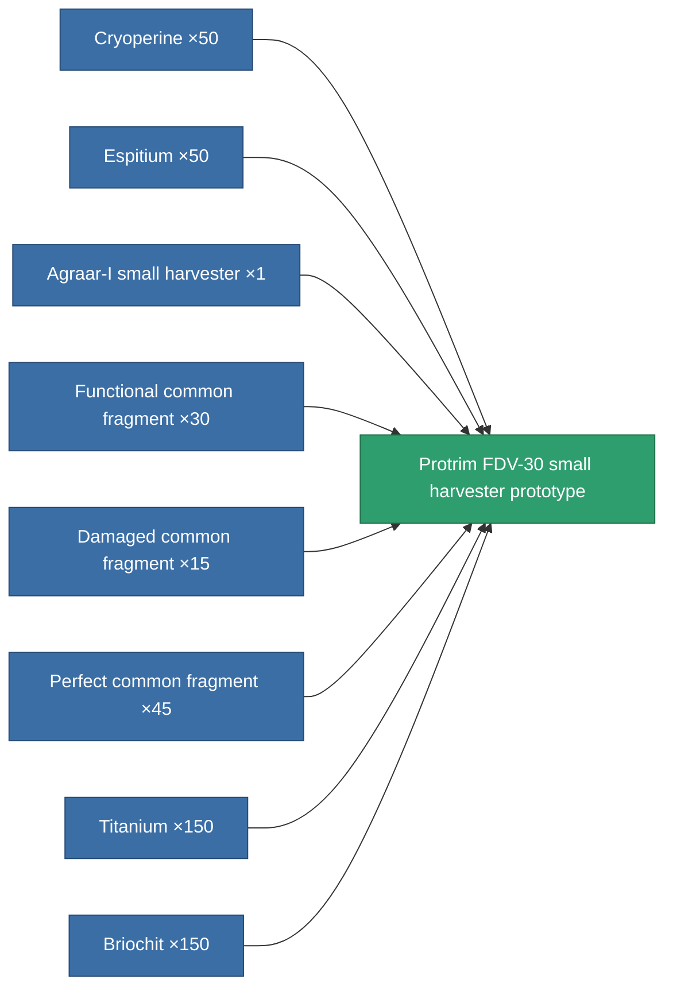

<!-- Generated by tools/generate from the live database (source: entitydefaults definition 2278, aggregatevalues via aggregatefields).
     Do not edit by hand; regenerate instead. -->

# Protrim FDV-30 small harvester prototype

|  |  |
|---|---|
| Definition | `def_named3_small_harvester_pr` |
| Tier | T4 (prototype) |
| Health | 100 |
| Volume | 1 |
| Mass | 300 |
| Category | Modules / Harvesting |
| Tier line | [Standard small harvester](/content/items/standard-small-harvester/) (T1) → [MHA 400-'Avalon' small harvester](/content/items/named1-small-harvester/) (T2) → [Agraar-I small harvester](/content/items/named2-small-harvester/) (T3) → [Protrim FDV-30 small harvester](/content/items/named3-small-harvester/) (T4) → **Protrim FDV-30 small harvester prototype** (T4) |

## Stats

| Field | Value |
|---|---|
| core_usage | 20 |
| cpu_usage | 42 |
| cycle_time | 12.5k |
| optimal_range | 3 |
| powergrid_usage | 31 |

<!-- production:generated -->
## Production

**Produced from 8 components, research level 4** — assemble the components to build it (see [Recipes](/content/recipes/) for the full list):

[All items](/content/items/)
