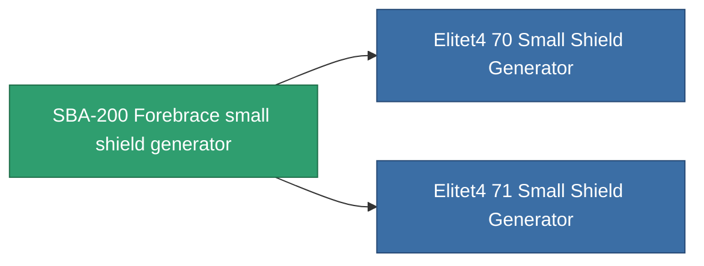

<!-- Generated by tools/generate from the live database (source: entitydefaults definition 725, aggregatevalues via aggregatefields).
     Do not edit by hand; regenerate instead. -->

# SBA-200 Forebrace small shield generator

|  |  |
|---|---|
| Definition | `def_named3_small_shield_generator` |
| Tier | 4 |
| Health | 100 |
| Volume | 0.3 |
| Mass | 230 |
| Category | Modules / Shield |
| Note | damage to core = shield_absorbtion * shield_absorbtion_modifier  amig ez a modul fut addig nincs damage, csak a core-bol von le.  |

## Stats

| Field | Value |
|---|---|
| core_usage | 1 |
| cpu_usage | 50 |
| cycle_time | 2k |
| powergrid_usage | 57 |
| shield_absorbtion | 2 |
| shield_radius | 6 |

<!-- production:generated -->
## Production

**Component of 2 items** — everything that uses it in production:

[All items](/content/items/)
